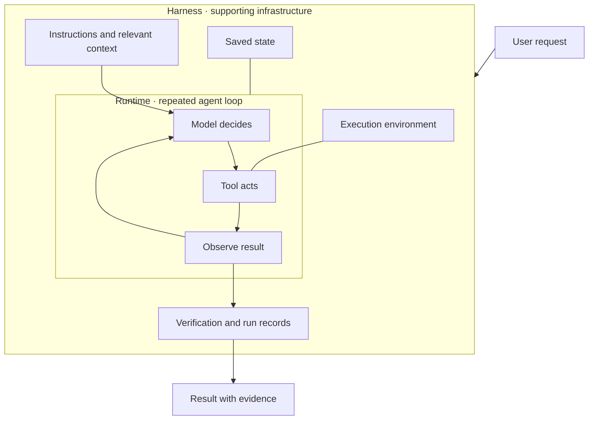
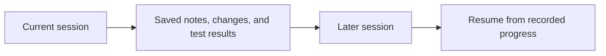
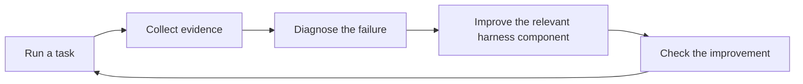
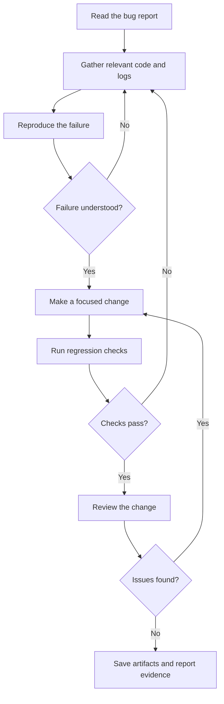

# Chapter 1 · The System Around the Model

> **The central idea:** an AI model needs a supporting system to turn its decisions into dependable work. That supporting system is the **harness**.

**Learning goals:** distinguish model, runtime, and harness; understand the ten parts of a harness; and diagnose failures using concrete evidence.

**Source:** [The Carbon Layer’s masterclass](https://www.youtube.com/watch?v=mQfTdNVCOB0) and [companion article](https://www.thecarbonlayer.com/harness-engineering/). This chapter explains the framework in original language, with additional teaching examples and diagrams. It is not a transcript or an independently verified reconstruction of every video segment.

---

## On this page

- [The three layers](#the-three-layers)
- [The ten parts of a harness](#the-ten-parts-of-a-harness)
- [A complete task in motion](#a-complete-task-in-motion)
- [Build your first harness](#build-your-first-harness)
- [Practice: diagnose the failure](#practice-diagnose-the-failure)

## The three layers

The masterclass distinguishes a **model** that reasons, a **runtime** that cycles through decisions and actions, and a **harness** that supplies the surrounding infrastructure. Its ten-part framework is the creator’s organizing model rather than a universal standard. The final part brings together verification, observability, and learning from failures. [Source](https://www.thecarbonlayer.com/harness-engineering/)

| Layer | Responsibility | Example in a coding task |
| :--- | :--- | :--- |
| **Model** | Interpret information and choose a response or action | Decide which file to inspect |
| **Runtime** | Execute the decide → act → observe cycle | Invoke a file-reading tool and return its result |
| **Harness** | Supply context, tools, state, boundaries, and checks | Provide the repository, save progress, and collect test results |



### Our running example

Imagine asking an agent:

> “Fix the login bug that happens after refreshing the page.”

The sections below show how you might design a harness for that task. These are illustrative design choices, not claims about a particular implementation in the video.

## The ten parts of a harness

### 1. Instructions · establish how to work

Give the agent explicit expectations:

```text
Follow the repository's coding conventions.
Reproduce the reported failure before making changes.
Run relevant checks after editing.
Report what remains unverified.
```

Keep the instructions specific enough to guide decisions. A rule such as “never change production” also needs access controls if it must be enforced mechanically.

**Design question:** which expectations belong in guidance, and which require enforcement?

### 2. Context delivery · supply task evidence

For the login bug, provide the error report, relevant code, failing test, and expected behavior. “Login is broken” leaves too many possible explanations: cookie configuration, token renewal, a database failure, or a redirect loop.

Delivering the actual failure helps the agent investigate the right problem.

**Design question:** what information would a human developer need before making a responsible change?

### 3. Context management · keep attention useful

A long investigation produces logs, code excerpts, failed approaches, and tool output. Decide what should stay in the model’s current working context.

A compact task record might look like this:

```text
Goal: Fix login after refresh.
Finding: Refresh-token cookie is absent from the request.
Changed: Cookie configuration.
Remaining: Run regression checks.
```

Preserve relevant facts, summarize repetitive output, and retrieve additional details when needed. A larger context window gives more capacity; selection still matters.

**Design question:** what does the agent need for its next decision?

### 4. Tool interfaces · enable action

Offer a small, clear set of operations:

```text
read_file(path)
search_code(query)
edit_file(path, changes)
run_command(command)
```

A tool’s result should explain what happened. For a test command, return its exit status and relevant output so the agent can distinguish success from failure.

**Design question:** can the agent understand both how to call the tool and how to interpret its result?

### 5. Execution environment · make access deliberate

Give the agent a workspace appropriate to its job: a repository checkout, dependencies, and a local test database. Choose filesystem, network, and credential access intentionally.

For our example, the environment should support reproducing login behavior locally. A separate workspace also makes the agent’s edits easier to inspect.

**Design question:** what resources must be reachable to complete this task?

### 6. Durable state · preserve progress

Save important findings and artifacts outside the current conversation. Git changes, checkpoints, task notes, and test logs can help a later session recover the investigation.



**Context management** chooses what to show now. **Durable state** keeps material available over time. They work together, but they solve different problems.

**Design question:** what would survive if the session ended immediately?

### 7. Orchestration · connect the steps

Define a workflow such as investigation, reproduction, editing, testing, and review. Decide how it responds to failed checks, timeouts, and missing information.

Some decisions can remain with the model. Others can be explicit program rules—for example, requiring successful checks before recording the task as complete.

**Design question:** what should happen next when a step succeeds or fails?

### 8. Subagents · divide focused work

A larger task might benefit from separate workers:

| Worker | Bounded assignment | Expected result |
| :--- | :--- | :--- |
| Investigator | Find the cause | Evidence and affected code |
| Reviewer | Inspect the proposed fix | Findings tied to the change |
| Test worker | Check regression cases | Results and remaining gaps |

A coordinator combines these outputs. Delegation introduces overhead, so use it when assignments can be separated meaningfully.

**Design question:** can each worker produce a result that the coordinator can assess?

### 9. Skills · capture recurring procedures

A reusable authentication-debugging procedure might instruct the agent to:

1. Establish the expected behavior.
2. Inspect cookies, sessions, and token renewal.
3. Reproduce the reported failure.
4. Make a focused change.
5. Check login, logout, and session renewal.

Package recurring expertise with supporting examples or scripts. Refine the procedure when experience reveals a missing step.

**Design question:** what workflow are you repeatedly explaining from scratch?

### 10. Verification, observability, and improvement · close the loop

These answer three connected questions:

| Concern | Question | Example evidence |
| :--- | :--- | :--- |
| **Verification** | Did the work succeed? | A regression check fails before the fix and passes afterward |
| **Observability** | What happened during the attempt? | Tool calls, errors, changes, and test output |
| **Improvement** | What should change next time? | A better debugging procedure or clearer tool result |



**Design question:** what evidence supports the completion claim, and what can the next run learn?

## A complete task in motion

Here is one possible workflow for the login example. Real investigations may return to earlier steps several times.



A useful completion report could state the cause, the change, the checks performed, and any remaining gap. This lets the user assess the result without relying on an unsupported “done.”

## Build your first harness

Start with one narrow task and a small set of tools. Add infrastructure in response to observed needs.

| Start with | Purpose |
| :--- | :--- |
| A clear task and success criterion | Define the outcome |
| Relevant context | Support informed decisions |
| Clear tools and a suitable workspace | Enable useful actions |
| Saved progress and artifacts | Make work recoverable |
| A concrete success check | Support completion with evidence |

You do not need multiple agents, elaborate memory, or a large workflow engine for every task. Complexity should earn its place by solving an observed problem.

## Practice: diagnose the failure

Match each symptom to a component worth investigating first. These are starting hypotheses, not guaranteed diagnoses.

| Symptom | First place to investigate |
| :--- | :--- |
| The agent invents behavior that the code does not have | Context delivery |
| It repeats an investigation after losing earlier findings | Context management and durable state |
| It misreads a command failure as success | Tool results and verification |
| It cannot reproduce the issue locally | Execution environment |
| Several workers return incompatible results | Delegation boundaries and shared procedures |
| It claims completion without checking the fix | Orchestration and verification |

**Try it:** choose a task you already perform. Write its success criterion, list the required tools, and decide what evidence would prove it succeeded.

---

[← Back to the chapter index](../README.md) · [Watch the masterclass ↗](https://www.youtube.com/watch?v=mQfTdNVCOB0)
