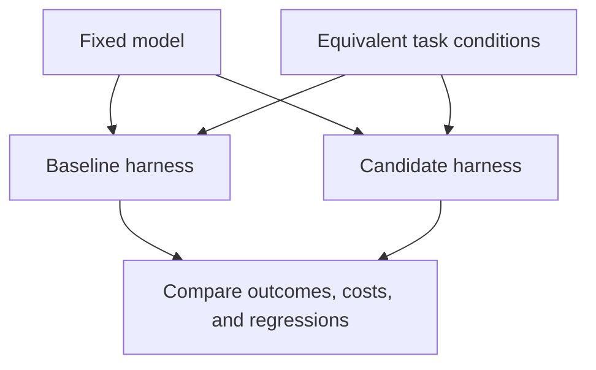
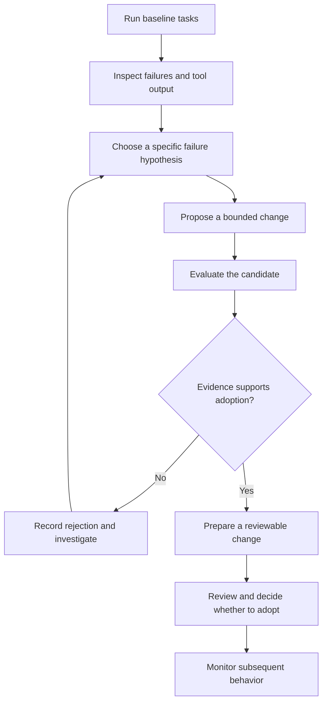
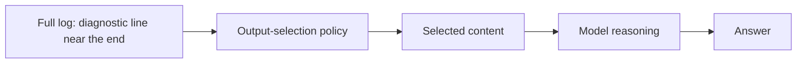
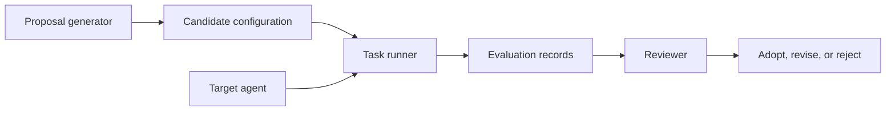
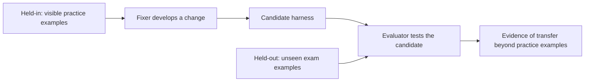

# Chapter 2 · Self-Improving Agent Harnesses

> **The central idea:** an agent can become more effective when its supporting software improves, even while its model weights stay fixed.

**Learning goals:** understand an improvement loop, distinguish a proposal from a proven improvement, and design an evaluation that reveals tradeoffs.

**Watch:** [Self-Improving AI Agents · Evolving the Harness, Not the Model](https://www.youtube.com/watch?v=KoDohnhLpJM), by The Carbon Layer.

**Reading basis:** the creator’s [companion article](https://www.thecarbonlayer.com/self-evolving-harness/). This is an original study guide, not a transcript. The source recap below is followed by independently constructed examples, diagrams, and a practical design exercise.

---

## On this page

- [What the creator demonstrates](#what-the-creator-demonstrates)
- [Understand the mechanism](#understand-the-mechanism)
- [Workshop: improve a log-analysis agent](#workshop-improve-a-log-analysis-agent)
- [Held-in, held-out, and the fixer](#held-in-held-out-and-the-fixer)
- [Miners and regression guards](#miners-and-regression-guards)
- [Measure improvements carefully](#measure-improvements-carefully)
- [Design a reviewable change](#design-a-reviewable-change)
- [Practice and reflection](#practice-and-reflection)

## What the creator demonstrates

The creator keeps a local Gemma model fixed while an external model proposes harness changes. A repeatable failure comes from truncating tool output before the relevant log content reaches the agent. One candidate increases the character limit from 4,000 to 12,000 and resolves the affected cases in his evaluation.

His process groups recurring failures, restricts editable configuration, and tests proposals on visible cases, hidden cases, and regression checks. He records runs, keeps grading separate from editable material, and produces a pull request for human review.

An important finding is that a nearly unchanged aggregate score can conceal a serious regression on one task. He also notes that repeated selection against hidden tasks gradually reveals information about them. Finally, increasing a limit remains a narrow solution: changing the output-selection strategy requires a broader editable surface. These are reported findings from his experiment, not guarantees for other agents. [Source](https://www.thecarbonlayer.com/self-evolving-harness/)

## Understand the mechanism

### Two different kinds of change

| Change | Example | What you evaluate |
| :--- | :--- | :--- |
| **Model change** | Replace the model or train its weights | How the new model behaves under a controlled setup |
| **Harness change** | Change tool-output handling | How the existing model behaves with the revised software |

For a harness experiment, hold the model and other important conditions stable. Otherwise, it becomes difficult to explain which change caused the result.



### The improvement loop

Here is a suggested workflow you can adapt. Its decisions should be backed by saved evidence.



A proposal is the beginning of an experiment. Adoption is a separate decision.

## Workshop: improve a log-analysis agent

The following scenario is invented for teaching. Its filenames, policies, and results are not measurements from the video.

### 1. Establish the task

Your agent must identify why a sample application failed to start. Its log includes thousands of routine messages, followed by:

```text
ERROR: Startup failed because the configured database host is unreachable.
```

The agent receives only the beginning of the log and answers that the cause is unclear.

### 2. Inspect the information path

Compare the original file with the actual tool response delivered to the model. An application can read a complete file internally but send only a shortened result to the agent.



If the diagnostic line disappears at the selection step, rewriting the agent's instructions cannot restore that missing evidence.

### 3. Write a testable hypothesis

```text
Hypothesis:
The current output policy removes the startup error.

Proposed experiment:
Preserve a bounded excerpt from both the beginning and end.

Expected effect:
The agent identifies the startup cause on new long-log examples.

Possible tradeoff:
Errors located in the middle may still be omitted.
```

The tradeoff matters. A policy can fix one placement of evidence while failing on another.

### 4. Define what may change

For this workshop, a configuration could expose:

```yaml
# Illustrative configuration; not code from the creator's repository.
version: 1
log_output:
  policy: head_and_tail
  max_characters: 12000
```

A configuration schema alone does not enforce permissions. If you automate proposal generation, also validate changed paths and keys, and control access to grading data.

### 5. Keep the roles distinct



The proposal generator suggests an intervention. The target agent performs tasks under that intervention. The evaluator checks results. The reviewer assesses whether the evidence and tradeoffs justify adoption.

## Held-in, held-out, and the fixer

Imagine a teacher gives a student **five practice questions**, followed by an exam with **five new questions**.

| Role or example | Exam analogy | Agent-improvement meaning |
| :--- | :--- | :--- |
| **Fixer** | The student developing a better method | The AI that investigates failures and proposes a harness fix |
| **Held-in** | Five practice questions visible while learning | Examples the fixer can inspect while developing the fix |
| **Held-out** | Five new exam questions unseen during preparation | Examples hidden from the fixer and used by the evaluator |
| **Evaluator** | The teacher checking answers | The system that runs tasks and grades the candidate fix |

The practice questions help develop the method. The new exam questions check whether that method works beyond the examples used to develop it.

For the log-file example, **Log A is held-in**: the fixer can inspect the failure and use it to propose a change. **Log B is held-out**: the evaluator runs the changed agent on it without showing that example to the fixer during development.



**Definitions for your notes:**

- **Fixer:** the AI that investigates failures and proposes a fix.
- **Held-in:** examples the fixer can see while developing the fix.
- **Held-out:** examples hidden during development and used to check the fix on unseen cases.

Held-out does **not** mean edge case. A hidden exam question can be ordinary or unusual. Also, passing a finite set of hidden cases is evidence of generalization, not proof that every possible input works.

Held-out tasks are run by the evaluator; they are not omitted from testing. Repeatedly using the same hidden set to select fixes can gradually overfit to it, so fresh examples may be needed over time.

## Miners and regression guards

Imagine your phone's camera is broken, but calls work. After a repair, you check both:

1. **Take a photo:** did the repair fix the known camera problem? This illustrates a **miner**.
2. **Make a call:** do calls still work after the repair? This illustrates a **regression guard**.

For the agent, a long-log question exposing the truncation problem is a miner. A short-log question that already worked is a regression guard.

**Definitions for your notes:**

- **Miners:** tests that expose a known weakness and check whether the fix solves it.
- **Regression guards:** tests that check whether the fix breaks anything that previously worked.

These labels answer a different question from held-in/held-out. **Miner or guard describes a test's purpose; held-in or held-out describes whether the fixer can see it.** A miner can be held-in or held-out, and so can a regression guard.

## Measure improvements carefully

### Include different evidence placements

Try short logs, long logs with errors near the beginning, errors near the end, and errors in the middle. Also include a log with insufficient evidence: a correct answer there may be an honest statement of uncertainty.

Keep some examples unavailable to the proposal generator. They can test whether the policy works beyond the exact example used to design it.

### Read individual outcomes

These are invented results that illustrate why a total can mislead:

| Task | Baseline passes | Candidate passes | Interpretation |
| :--- | ---: | ---: | :--- |
| Error near the end | 0/5 | 5/5 | Clear gain in these runs |
| Error in the middle | 5/5 | 0/5 | Serious regression |
| Short log | 5/5 | 5/5 | Stable |
| **Total** | **10/15** | **10/15** | Equal totals conceal different behavior |

Repeat trials when outcomes vary. Preserve run counts and individual results; five successful attempts are evidence from five attempts, not proof of universal reliability.

### Track more than correctness

Record latency, output size, and operational cost where they matter. Define acceptance criteria before comparing candidates so you do not quietly change the standard to favor a preferred result.

## Design a reviewable change

A useful change description could contain:

```text
Problem:
The delivered log excerpt omits the terminal startup error.

Change:
Preserve bounded beginning and ending excerpts.

Evidence:
Attach individual baseline and candidate results.

Limitations:
Evidence in the middle can still be omitted.

Recovery:
Restore the previous versioned configuration if monitoring reveals regressions.
```

Store the actual diff and evaluation artifacts with the report. A reviewer should be able to connect the proposed mechanism to the measured outcome.

## Practice and reflection

Choose a failure from an agent you use and answer:

1. What observable behavior counts as failure?
2. What evidence supports your explanation of its cause?
3. What is the smallest intervention you can test?
4. Which existing behavior could that intervention harm?
5. Which examples should remain unavailable during proposal generation?
6. What would justify rejecting the candidate?

**Connection to Chapter 1:** the harness provides the tools, context, state, and checks. An improvement process uses evidence from those components to propose and evaluate their next version.

---

[← Chapter 1](01-the-system-around-the-model.md) · [Chapter index](../README.md) · [Watch the video ↗](https://www.youtube.com/watch?v=KoDohnhLpJM)
