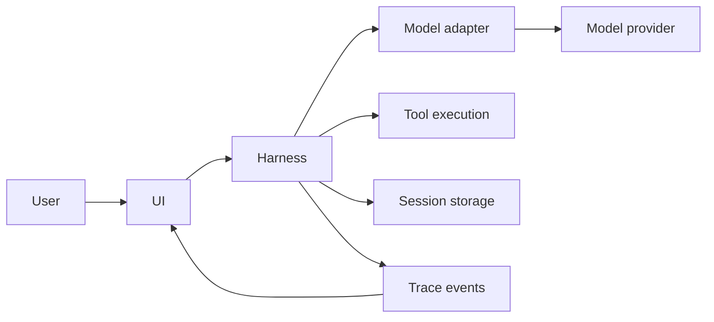
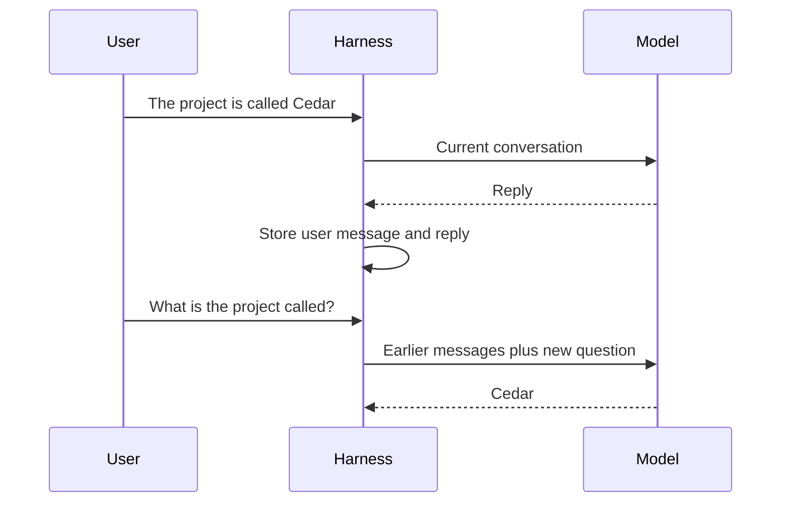
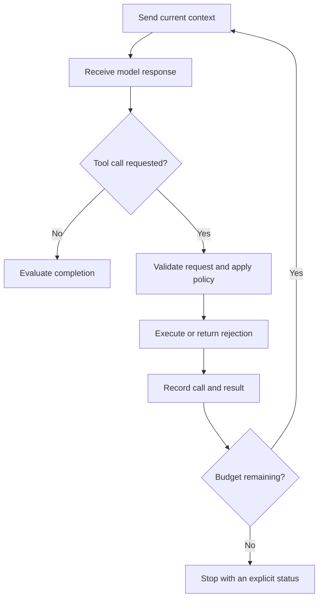
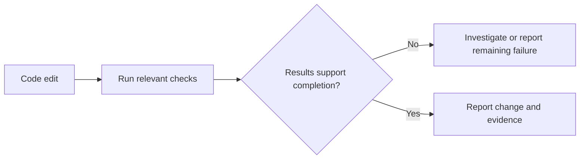

# Chapter 3 · Building an AI Agent From Scratch

### From a single model call to a working harness

> **The central idea:** build one capability at a time, and inspect the software responsible for each new behavior.

**Learning goals:** understand conversation history, trace a tool-use loop, separate model access from orchestration and presentation, and design checks for the agent you build.

**Watch:** [Building an AI Agent From Scratch in Python — One Primitive at a Time](https://www.youtube.com/watch?v=oUBgqzcV1qw), by The Carbon Layer.

**Sources:** [creator’s companion article](https://www.thecarbonlayer.com/building-an-agent-from-scratch/) · [original Carbon repository](https://github.com/thecarbonlayer/carbon).

This is an original study guide, not a transcript. The recap describes the creator’s build. The workshop uses independently written examples: its Python snippets are teaching sketches, not copied source or a complete runnable agent.

---

## On this page

- [What the creator builds](#what-the-creator-builds)
- [The architecture to keep in mind](#the-architecture-to-keep-in-mind)
- [Workshop: grow a small agent](#workshop-grow-a-small-agent)
- [Add the supporting capabilities](#add-the-supporting-capabilities)
- [Make completion inspectable](#make-completion-inspectable)
- [Study the original implementation](#study-the-original-implementation)
- [Practice](#practice)

## What the creator builds

The video develops a Python coding agent through stages numbered 0–14. It starts with setup and a bare model call, then adds history, instructions, file context, tools, context management, skills, containment, persistence, planning, delegation, verification, tracing, and a terminal interface. [Video chapter information](https://zolotube.com/watch?v=oUBgqzcV1qw)

The companion article describes three packages: UI, harness, and model access, with dependencies flowing in that order. The model remains fixed while the supporting code grows. The creator uses a deliberately small educational implementation to make each mechanism understandable. His verification stage requires an observed successful test command for qualifying code edits, and the final interface shows conversation alongside execution traces. [Companion article](https://www.thecarbonlayer.com/building-an-agent-from-scratch/)

The original repository preserves stages using tags `ch-00` through `ch-14`. Use those historical snapshots when following the lesson; later development on the default branch may differ. [Original repository](https://github.com/thecarbonlayer/carbon)

## The architecture to keep in mind

For your own implementation, give each layer a narrow responsibility.

| Layer | Owns | Example interface |
| :--- | :--- | :--- |
| **Model adapter** | Provider-specific requests and response normalization | `generate(messages, tools)` |
| **Harness** | History, execution, state, and completion rules | `run_turn(user_text)` |
| **UI** | Input, progress display, and user interaction | Display messages and events |



A provider swap should not require rewriting the conversation screen. A UI change should not rewrite tool-execution policy.

## Workshop: grow a small agent

### Step 1 · Start with one request

Assume you provide an adapter function named `generate_text`. This is a placeholder for your chosen provider, not a Python built-in.

```python
def answer_once(question, generate_text):
    messages = [{"role": "user", "content": question}]
    return generate_text(messages)
```

Each invocation creates a new message list. If you first tell it a project name and then ask for that name, the second request has no record of the first unless your application supplies one.

**Check:** inspect the outgoing request rather than guessing what the model remembers.

### Step 2 · Keep conversation history

Here is a text-only sketch of application-managed history:

```python
class Conversation:
    def __init__(self, generate_text):
        self.generate_text = generate_text
        self.messages = []

    def send(self, text):
        self.messages.append({"role": "user", "content": text})
        reply = self.generate_text(list(self.messages))
        self.messages.append({"role": "assistant", "content": reply})
        return reply
```

Real implementations also need error handling and provider-specific message validation. Tool-enabled conversations require additional message types.



This illustrates where conversational continuity comes from. It does not establish that the model will always recall every supplied detail accurately.

### Step 3 · Supply task guidance and evidence

For a task such as “explain this parser failure,” assemble:

- The expected parser behavior.
- The relevant implementation.
- A sample input and observed output.
- The project’s working conventions.

Keep retrieved file contents distinguishable from the instructions controlling the agent. Record where excerpts came from so a user can inspect them later.

### Step 4 · Add one tool

Start with a simple read operation before adding broad command execution. A tool interface needs a description, input validation, execution logic, and a useful result.

| Piece | Example purpose |
| :--- | :--- |
| Description | Explain which file-reading task the tool supports |
| Input contract | Require a path string |
| Validation | Confirm the resolved path is allowed |
| Execution | Read within configured size limits |
| Result | Return content or a clear error |

Avoid assuming a declared schema provides every validation or permission check your executor needs.

### Step 5 · Build a bounded action loop



Preserve call identifiers and tool results according to your provider’s protocol. Give the loop limits for steps, time, or cost, and make exhaustion visible to the user.

## Add the supporting capabilities

### Context budgets

History grows. Choose what to preserve, what to summarize, and what to retrieve again. Test summaries using facts the agent will need later. An output limit should disclose truncation so missing evidence is not mistaken for a complete file.

### Reusable procedures

Package a recurring job, such as reviewing parser edge cases, into a procedure with inputs, steps, and expected evidence. Load the relevant procedure when the job requires it instead of attaching every possible procedure to every request.

### Workspace boundaries

Make permitted paths and actions explicit. Validate resolved paths, including cases involving symbolic links. If you introduce command execution, define its environment and permissions before exposing it through a tool.

### Persistent sessions

Save enough information to resume after a restart: messages, relevant tool results, and task status. Use a stable session identifier and a storage format you can inspect. Define how interrupted or incomplete writes are recovered.

### Plans and delegation

For a multi-step task, record steps with observable outcomes. If delegating, provide each worker a clear brief and ask for evidence that the coordinator can assess. A worker’s answer is input to the final decision, not automatic proof of success.

## Make completion inspectable

Suppose your agent edits a parser. A useful completion rule could require a regression check for the reported input and the repository’s relevant checks.



A command returning exit code zero is evidence about that command. It does not by itself prove the tests were meaningful, ran against the intended files, or covered every requirement.

Track events that help explain the run:

| Event | Useful recorded fields |
| :--- | :--- |
| Model request | Configuration, timing, available usage counts |
| Tool action | Validated arguments, result status, relevant output |
| Check | Command, workspace, exit status, result |
| Session milestone | Saved artifact references and task status |

Use those events to power the interface. Showing progress is most useful when it reflects real execution state.

## Study the original implementation

The creator’s repository is the place to inspect exact source, installation requirements, and chapter-specific commands:

**[Open the Carbon course repository →](https://github.com/thecarbonlayer/carbon)**

A useful study method is to compare adjacent chapter tags, identify the new behavior, and locate the code that enables it. Keep our document’s chapter numbering separate from the video’s internal build stages: this is **Chapter 3 of these notes**, covering a video with stages **0–14**.

## Practice

Try these exercises with a small prototype:

1. Send two independent requests, then repeat them with saved history. Inspect the difference in request contents.
2. Add a file-reading tool and test an allowed file, a missing file, and a path outside the workspace.
3. Set a small action budget and verify that exhaustion produces a clear status.
4. Restart a session and check whether its saved progress can be recovered.
5. Propose a deliberately incorrect code edit and confirm that a meaningful check catches it.

**Connection to earlier chapters:** Chapter 1 provides the conceptual map. Chapter 2 examines how to evaluate harness improvements. This chapter shows how to reason about the small mechanisms you would implement and improve.

---

[← Chapter 2](02-self-improving-agent-harnesses.md) · [Chapter index](../README.md) · [Watch the video ↗](https://www.youtube.com/watch?v=oUBgqzcV1qw)
