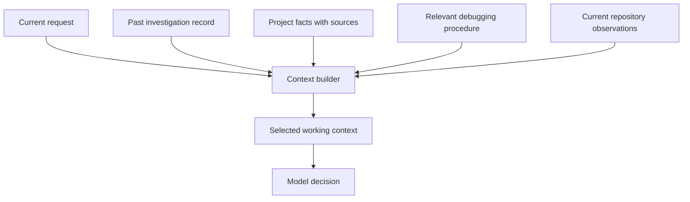
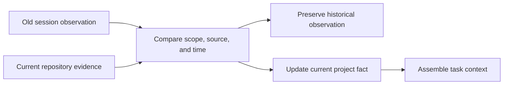
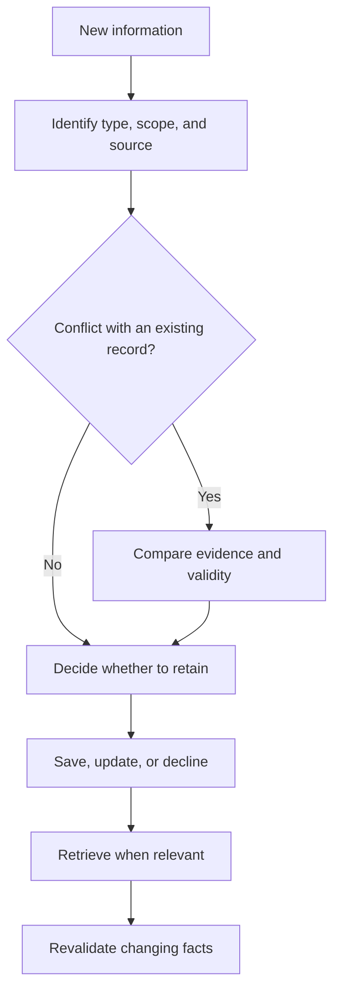
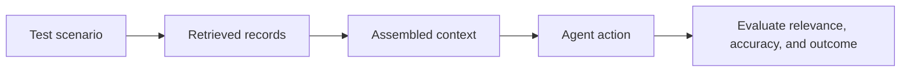

# Chapter 4 · Agent Memory Architecture

### How agents remember, update, and forget

> **The central idea:** useful memory requires choosing what to save, what to retrieve, and what still applies to the current task.

**Learning goals:** distinguish four memory types, understand how stored information enters a model request, and test whether an agent uses current, relevant facts.

**Watch:** [AI Agent Memory Masterclass · How Agents Remember and Forget](https://www.youtube.com/watch?v=PxuMqeIqCEo), by The Carbon Layer.

**Reading basis:** [Agent memory is context assembly over time](https://www.thecarbonlayer.com/agent-memory-architecture/), the creator’s companion article.

This chapter is an original study guide, not a transcript. The recap describes the creator’s framework; subsequent examples and diagrams are independently constructed teaching material.

---

## On this page

- [What the creator teaches](#what-the-creator-teaches)
- [Four kinds of memory](#four-kinds-of-memory)
- [Workshop: resume a project accurately](#workshop-resume-a-project-accurately)
- [Design a memory record](#design-a-memory-record)
- [Updating and forgetting](#updating-and-forgetting)
- [Evaluate memory behavior](#evaluate-memory-behavior)
- [Practice](#practice)

## What the creator teaches

The creator describes memory as the intersection of context management and durable state. His framework distinguishes working, episodic, semantic, and procedural memory. The runtime assembles selected material into the model’s current context.

His example combines a current coding request, prior issue history, project facts, and a required workflow. Old session records must be distinguished from current issue state. Relevant text alone does not establish what is true now.

He emphasizes maintenance: compressing past sessions, updating contradictory facts, revising procedures, and reducing the priority of stale material. A larger context window does not perform those jobs automatically. His practical questions concern what the model sees now, which past events matter, which facts remain current, which procedure applies, and what should lose priority. [Source](https://www.thecarbonlayer.com/agent-memory-architecture/)

## Four kinds of memory

The following table uses an invented project called **Cedar** to illustrate the categories. These categories describe responsibilities; you do not necessarily need four separate databases.

| Type | Question it helps answer | Cedar example |
| :--- | :--- | :--- |
| **Working** | What information is available for this decision? | The current request and selected code excerpts |
| **Episodic** | What happened on a particular occasion? | Yesterday’s parser investigation failed on empty input |
| **Semantic** | What fact or convention should currently apply? | Cedar currently uses Python 3.12 |
| **Procedural** | How should this task be performed? | Reproduce parser failures, edit, then run relevant checks |

### Working memory · the current request context

Imagine the agent receives your question, a parser file, and a failing test result. That material is its immediate working context.

If a needed detail exists only in a saved session, the application must retrieve it before the model can use it in this request. Inspecting the actual assembled request helps distinguish “the agent failed to use the fact” from “the fact was never supplied.”

### Episodic memory · dated experience

A useful event record might say:

```text
Session: cedar-parser-017
Observed: 2026-10-01
Task: Investigate empty-input failure.
Finding: parse_record returns an unexpected value.
Outcome: Investigation completed; no fix verified.
```

The outcome is deliberately precise. An investigation record should not later become a claim that the bug was fixed.

### Semantic memory · maintained facts

A project fact could state the current runtime version or test command. Keep its scope and supporting source so the agent can distinguish one project’s convention from another’s.

For changing facts, record when they were checked. A previous value can remain useful as history even after a new value becomes current.

### Procedural memory · reusable steps

An illustrative parser-debugging procedure might be:

1. Read the expected input format.
2. Reproduce the smallest failing input.
3. Inspect the relevant parsing path.
4. Make a focused change.
5. Run the regression check and relevant existing tests.
6. Report the result and any gap.

A procedure needs maintenance when repository commands or expectations change.

## Workshop: resume a project accurately

Suppose you ask:

> “Continue yesterday’s Cedar parser investigation and use the current project checks.”

A memory system needs to combine the past investigation with current repository evidence.



### Retrieve a focused slice

Search for the project, task, and symptom. Return the relevant outcome and unresolved questions rather than every message from every past session.

A semantic similarity score can help rank candidates. It does not determine whether a retrieved statement is current, verified, or applicable.

### Check changes in state

Yesterday’s note says the test command was `python -m pytest`. Today’s repository instructions may declare a different command. Compare the sources before treating the old record as present-day guidance.



Recency alone is insufficient: an old authoritative policy can be more relevant than a new unverified guess. Resolve differences using source quality and task scope as well as time.

### Preserve uncertainty

If you cannot verify that yesterday’s proposed fix was applied, say so in the task state. A stored statement such as “I plan to fix this” is not evidence that the fix exists.

## Design a memory record

Here is an illustrative record, not a schema from the creator’s implementation:

```json
{
  "id": "cedar-runtime-version",
  "type": "semantic",
  "scope": "project:cedar",
  "statement": "The declared Python version is 3.12",
  "source": "repository configuration",
  "observed_at": "2026-10-02",
  "status": "current",
  "supersedes": "cedar-runtime-version-old"
}
```

| Field | Purpose |
| :--- | :--- |
| Scope | Avoid applying one project’s fact to another |
| Source | Allow inspection and revalidation |
| Observation time | Explain when the evidence was checked |
| Status | Distinguish current facts from historical records |
| Supersedes | Preserve a traceable update relationship |

Choose fields that serve your application. Storing a confidence number is useful only if you define what it means and how it is produced.

## Updating and forgetting

### Treat new information as a candidate

Do not automatically promote every conversation sentence into a permanent fact. Distinguish preferences, observations, plans, and verified outcomes.



### Define what forgetting means

Forgetting can involve several distinct operations:

| Operation | Effect |
| :--- | :--- |
| Deprioritize | Keep a record but stop routinely retrieving it |
| Summarize | Preserve selected facts while reducing detail |
| Supersede | Retain old state as history and identify its replacement |
| Delete | Remove the record according to an explicit retention rule |

These operations are not interchangeable. A summary may lose details; a superseded fact should not silently regain current status; deletion should account for related indexes or copies.

## Evaluate memory behavior

The following are suggested tests for a small memory-enabled prototype.

| Scenario | Desired behavior |
| :--- | :--- |
| Resume after a restart | Recover the recorded task state |
| Project changes its test command | Use the verified current command |
| Two projects share similar filenames | Retrieve facts from the correct scope |
| A note records a proposed fix | Avoid reporting it as completed work |
| No relevant memory exists | Ask for missing information or inspect available evidence |
| A stored preference conflicts with the current request | Follow the current request where applicable |
| An important record is superseded | Keep history while using the replacement |



Inspect each stage. A bad answer may come from failed retrieval, stale records, incorrect context assembly, or poor reasoning over correctly supplied evidence.

## Practice

Pick a project you work on and write:

1. One current fact with a supporting source.
2. One dated event with an explicit outcome.
3. One reusable procedure.
4. One situation in which each record should be checked again.
5. One test that would reveal inappropriate recall.

**Connection to earlier chapters:** Chapter 1 introduces context and durable state. Chapter 3 shows application-managed history and persistence. This chapter explores how to maintain that information so future requests receive useful, current context.

---

[← Chapter 3](03-building-an-agent-from-scratch.md) · [Chapter index](../README.md) · [Watch the video ↗](https://www.youtube.com/watch?v=PxuMqeIqCEo)
