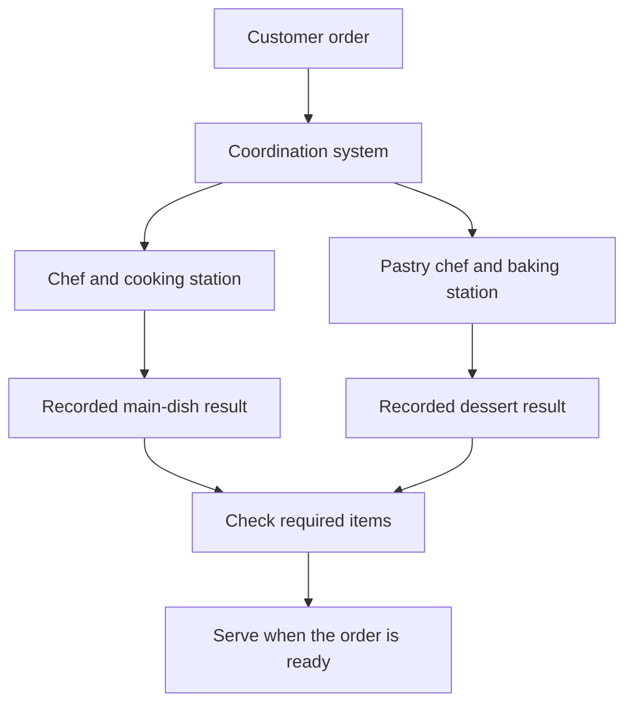
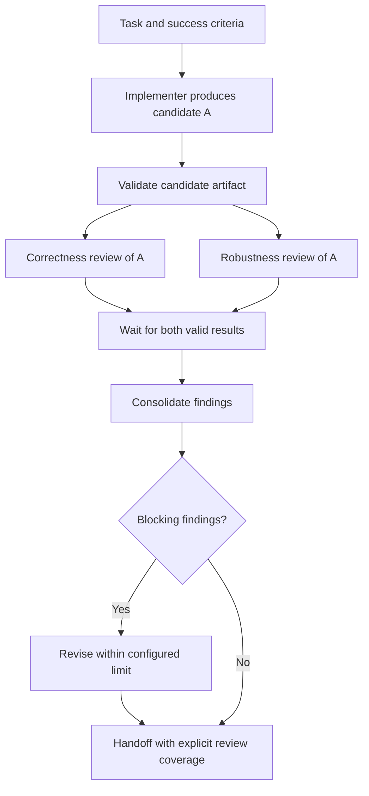
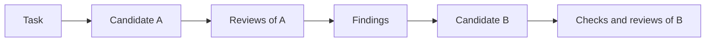
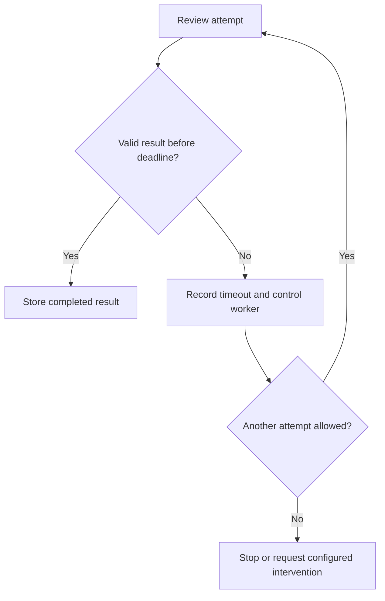

# Chapter 5 · Meta-Harness: Coordinating Multiple Agents

### From individual workers to an inspectable workflow

> **The central idea:** several capable agents still need a system that tracks assignments, permissions, results, and failures.

**Learning goals:** distinguish an agent harness from a meta-harness, understand the coordination responsibilities, and reason about failure recovery using simple examples.

**Watch:** [Meta-Harness · Designing Multi-Agent AI Systems](https://www.youtube.com/watch?v=HRUBDPdvaHU), by The Carbon Layer.

**Reading basis:** [A meta-harness is coordination that lives outside the agents](https://thecarbonlayer.com/meta-harness/).

This is an original study guide, not a transcript. The recap identifies the source’s design; the restaurant analogy, examples, diagrams, and exercises below are independently constructed teaching material.

---

## On this page

- [What the creator designs](#what-the-creator-designs)
- [Real-life example: a restaurant team](#real-life-example-a-restaurant-team)
- [Eight coordination responsibilities](#eight-coordination-responsibilities)
- [Workshop: implement and review a change](#workshop-implement-and-review-a-change)
- [Failure and recovery](#failure-and-recovery)
- [Judgment and workflow rules](#judgment-and-workflow-rules)
- [Practice](#practice)

## What the creator designs

A harness supports one agent loop; a meta-harness coordinates multiple harnessed workers. The creator proposes versioned workflows with coordination handled in external code, while agents perform bounded reasoning tasks.

The design has eight components: agent package registry, harness adapter layer, role and policy binder, workflow engine, worker lifecycle manager, execution environment manager, state and artifact store, and event and control plane.

His implementation-and-review example tracks candidate commits, independent reviews, revision limits, and a human handoff. A worker timeout must not silently count as a completed review. Saved artifacts need provenance, and retaining files is different from safely resuming execution. Adapters must disclose differences such as cancellation and resume support.

This episode presents an architecture, not proof that every capability exists. The article explicitly identifies gaps between the design and its forthcoming thin prototype. [Source](https://thecarbonlayer.com/meta-harness/)

## Real-life example: a restaurant team

Imagine a restaurant handling an order:

- A chef prepares the main dish.
- A pastry chef prepares dessert.
- A server checks that the order is complete.
- A manager handles missing items and delays.

Each person needs tools, instructions, and a suitable workspace. That resembles an individual **agent harness**.

The restaurant also needs an order system: who owns each dish, what is ready, whether the whole order can leave, and what happens if someone is unavailable. That resembles a **meta-harness**.

If dessert is missing, “the main dish is ready” does not mean “the order is complete.” Likewise, one agent completing its assignment does not prove that a multi-agent workflow is complete.

## Eight coordination responsibilities

The table uses the source’s component names, with original restaurant examples to clarify their roles.

| Component | Restaurant analogy | Example software responsibility |
| :--- | :--- | :--- |
| **Agent package registry** | A roster of trained staff and specialties | Identify a worker configuration and version |
| **Harness adapter layer** | A common way to send assignments to different stations | Normalize start, result, and supported controls |
| **Role and policy binder** | Assign someone as chef or inspector for this order | Apply task-specific authority |
| **Workflow engine** | The order’s preparation and completion sequence | Decide which steps may run next |
| **Worker lifecycle manager** | Track whether staff started, finished, or became unavailable | Handle timeouts and attempts |
| **Execution environment manager** | Equip each station for its assigned job | Provide workspace and resource boundaries |
| **State and artifact store** | Order status plus prepared-item records | Preserve progress and produced evidence |
| **Event and control plane** | Kitchen status board and management controls | Expose progress and authorized interventions |

These responsibilities can begin as small modules in one application. Their separation is about clear ownership; it does not require eight separately deployed services.

## Workshop: implement and review a change

The following workflow is illustrative. It is not a claim that we implemented the creator’s runtime in this repository.

### 1. Define the outcome

Task: fix a parser that mishandles empty input.

Specify expected behavior and required checks. Assign an implementer and two reviewers with different review briefs.

### 2. Give workers appropriate access

| Role | Needed material | Example boundary |
| :--- | :--- | :--- |
| Implementer | Task, repository, checks | Write within its workspace |
| Correctness reviewer | Candidate snapshot and expected behavior | Inspect without editing |
| Robustness reviewer | Same candidate and edge-case requirements | Inspect without editing |
| Consolidator | Review findings and source references | Combine findings without changing code |

A role description explains the job. Executor permissions and workspace controls enforce its access.

### 3. Run the required steps

If revision produces candidate B, reviews of A do not automatically establish B’s correctness. Re-review B where required, or clearly disclose the missing coverage.

### 4. Preserve the relationship between artifacts

Record candidate identifiers alongside reviews and test results. This makes “which version was checked?” answerable.

## Failure and recovery

### A reviewer times out

Suppose correctness review completes, while robustness review fails to finish.

A sensible policy could preserve the valid correctness result and retry robustness review once. If that attempt also fails, report the incomplete review instead of declaring success.

A timeout event does not itself prove the worker stopped. The adapter must implement cancellation or termination where possible and report what happened.

### A retry might duplicate work

Use another everyday example: you submit a food order, but the confirmation screen freezes. Pressing “order” again could create a duplicate.

The same problem occurs if a worker creates a pull request but its completion message is lost. Before retrying, check whether the intended result already exists.

An **idempotent operation** has the same intended effect when repeated. For example, an order service can recognize a unique request identifier and return the existing order instead of creating another one. External agent actions need similarly explicit ownership and duplicate handling.

### Saved progress is only part of recovery

A saved review file proves that a file survived. Safe resumption also requires knowing whether it is valid for the current candidate, which actions already occurred, and which steps remain.

## Judgment and workflow rules

| Task | Suitable owner in this example |
| :--- | :--- |
| Explain why a parser branch is incorrect | Agent judgment, backed by evidence |
| Interpret whether two findings describe the same issue | Agent-assisted analysis |
| Count allowed attempts | Workflow code |
| Require both reviews before proceeding | Workflow code |
| Apply workspace access restrictions | Executor and environment controls |
| Confirm a referenced candidate exists | Direct repository inspection |

Code-defined rules improve inspectability, but still need testing. Moving a rule into code does not automatically make its implementation correct.

## Practice

Design a workflow for writing and checking a report:

1. Assign a researcher, writer, and fact checker.
2. Define each worker’s input and expected output.
3. Decide which steps can run together and which must wait.
4. Specify what happens if the fact checker times out.
5. Record which draft each check examined.
6. Define a final completion rule that exposes missing checks.

**Connection to earlier chapters:** individual harnesses supply tools, context, memory, and checks. A meta-harness adds coordination between those workers, including shared workflow state and evidence about their outputs.

---

[← Chapter 4](04-agent-memory-architecture.md) · [Chapter index](../README.md) · [Watch the video ↗](https://www.youtube.com/watch?v=HRUBDPdvaHU)
