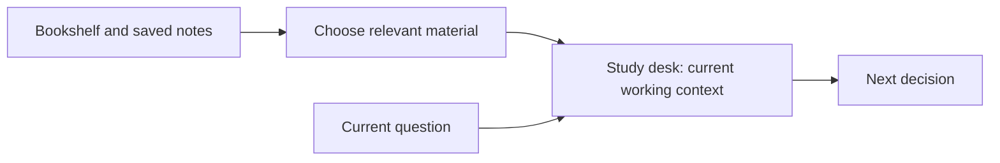
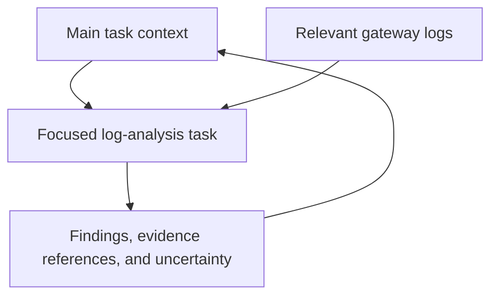
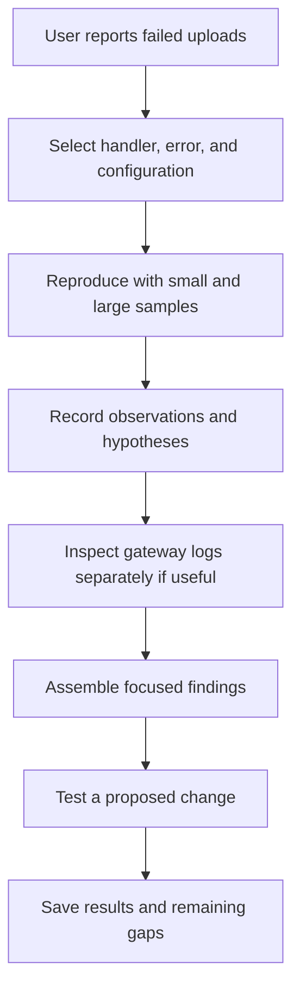
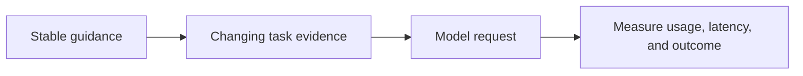

# Chapter 6 · Context Management

### Choosing what the model sees next

> **The central idea:** having information somewhere in the system is different from supplying useful information for the model’s next decision.

**Learning goals:** understand four context-management moves, recognize poor context, and inspect whether a summary preserves the evidence a task needs.

**Watch:** [Context Management Masterclass · Technical Deep Dive Managing Context Agentic Systems](https://www.youtube.com/watch?v=mM_Wxemh3lU), by The Carbon Layer.

**Reading basis:** [Context management decides what the model sees this turn](https://www.thecarbonlayer.com/context-management/).

This chapter is an original study guide, not a transcript. The recap identifies the creator’s framework; the analogies, workshop, and diagrams are independently constructed examples. Product-specific behavior can change, so these notes emphasize the underlying design choices.

---

## On this page

- [What the creator teaches](#what-the-creator-teaches)
- [Everyday example: your study desk](#everyday-example-your-study-desk)
- [Four moves](#four-moves)
- [Workshop: debug a failed upload](#workshop-debug-a-failed-upload)
- [Recognize context problems](#recognize-context-problems)
- [Costs and tradeoffs](#costs-and-tradeoffs)
- [Inspect the actual request](#inspect-the-actual-request)
- [Practice](#practice)

## What the creator teaches

The creator describes a long debugging session in which the agent repeated work and contradicted earlier decisions as logs and other material accumulated. His organizing framework has four moves: **select, compress, write, and isolate**.

Selection chooses relevant material and its placement. Compression reduces bulk but can discard crucial details. Writing moves important task information into reloadable artifacts. Isolation gives a subtask its own working context and returns a focused result.

He also discusses contradictory or misleading context, prompt-prefix stability, and the importance of inspecting what actually reaches the model. His account compares harness strategies, but those product-specific details are observations from the source rather than permanent guarantees. Context management cannot compensate for every reasoning limitation or recover information that was never delivered. [Source](https://www.thecarbonlayer.com/context-management/)

## Everyday example: your study desk

Imagine you are solving a physics question. You have a textbook, yesterday’s notes, worksheets, a calculator, and several unrelated books.

Putting everything on the desk does not necessarily help. You need the right chapter, the relevant formula, and the problem’s constraints.

| Your study habit | Agent equivalent |
| :--- | :--- |
| Open the relevant chapter | Select context |
| Make a concise formula sheet | Compress context |
| Save your working and conclusions in a notebook | Write task state |
| Ask someone to check a separate calculation | Isolate a subtask |

The desk represents the model’s current context. The notebook and bookshelf represent material the application can retrieve later.



A larger desk helps with capacity. You still need to organize it.

## Four moves

### 1. Select · bring the needed evidence

For a question about why an upload fails, begin with the upload handler, the reported error, and relevant configuration. Retrieve additional files when the investigation needs them.

Selection also applies to tool descriptions and procedures. A database-maintenance checklist may be irrelevant to diagnosing an upload limit.

**Check:** can you explain why each large item is in the next request?

### 2. Compress · preserve decision-relevant meaning

Compare these invented summaries:

| Summary | What it preserves |
| :--- | :--- |
| “Uploads sometimes fail.” | Only a broad symptom |
| “Requests above 8 MB return HTTP 413; smaller requests succeed. The gateway limit is the leading hypothesis.” | A boundary, an observed result, and a hypothesis |

The second summary is more useful for the next investigation step. It still needs source references so its claims can be checked.

Compression is not proof-preserving by default. A summary may accidentally turn a hypothesis into a conclusion or erase an unresolved question.

**Check:** does the summary preserve the distinction between observed, suspected, and verified?

### 3. Write · preserve a recoverable task record

Create a short working note:

```text
Task: Diagnose upload failures.
Observed: HTTP 413 on a 9 MB sample; 2 MB sample succeeds.
Hypothesis: Request-size limit before the application handler.
Checked: Handler was not reached for the failing request.
Remaining: Inspect gateway settings and repeat the boundary test.
Evidence: Saved request results and configuration snapshot.
```

Writing the note does not automatically put it in future context. The harness needs a retrieval step, and the note must be updated as findings change.

**Check:** could a fresh session resume accurately from this record?

### 4. Isolate · separate a focused investigation

A helper could inspect gateway logs while the main agent investigates application code. Give the helper a clear question and an output contract.



The main agent needs enough evidence to assess the returned conclusion. “It is a gateway problem” alone is insufficient.

Isolation can add coordination overhead and duplicate work. Use it when separation serves the task.

## Workshop: debug a failed upload

This scenario is original teaching material; it is not the creator’s streaming-app investigation.



Suppose an old design document says uploads up to 20 MB are supported, but the deployed gateway rejects requests above 8 MB. Keep both statements labeled by source and time. The document describes intended behavior; the observed gateway response describes the tested deployment.

After a fix, update the task record. Preserve earlier observations as history rather than leaving them mixed with current state.

## Recognize context problems

Here are practical diagnostic examples. A symptom may have more than one cause.

| Problem | Upload-example symptom | Useful investigation |
| :--- | :--- | :--- |
| Incorrect information persists | An early guess is later treated as proven | Trace the claim to its evidence |
| Irrelevant material dominates | Large unrelated logs obscure the failure | Inspect item sizes and relevance |
| Material causes ambiguity | Several environments are discussed without labels | Add scope and source information |
| Sources contradict each other | Old docs and deployed settings disagree | Distinguish intended, historical, and current state |
| Summary loses evidence | The 8 MB boundary disappears | Compare the summary with source results |

## Costs and tradeoffs

### Larger context

More capacity can help when a task truly needs many details. It does not guarantee that every relevant detail will be used correctly. Test placement and context composition with your actual model and tasks rather than assuming one universal arrangement.

### Compression

A summarization step can reduce later request size, but it also takes time and may incur model cost. Measure its net effect across the whole task, including any rediscovery caused by lost information.

### Stable prefixes

Some serving systems reuse computation for supported matching prompt prefixes. Consider keeping stable instructions separate from frequently changing observations, but check your provider’s actual caching conditions and measurements.



A cache hit can improve efficiency. It does not establish that the chosen context is relevant or correct.

## Inspect the actual request

The interface’s visible conversation may differ from what the application sends to the model. When debugging behavior, inspect the assembled messages, available tool descriptions, and retrieved excerpts where your system permits it.

Ask:

- Was the relevant evidence included?
- Was any material truncated?
- Did a summary preserve important constraints?
- Are current facts distinguishable from older observations?
- Are several copies of the same material consuming space?
- Can claims be traced back to saved evidence?

This turns a vague complaint such as “the agent lost track” into specific hypotheses you can test.

## Practice

Take a long task you have already completed:

1. List the evidence needed for its next decision.
2. Remove one large irrelevant item.
3. Write a five-line task summary with source references.
4. Identify one fact the summary must preserve exactly.
5. Decide whether any subtask deserves separate context.
6. Compare the next result with and without your context changes.

**Connection to Chapter 4:** memory maintains information over time. Context management selects and prepares the information used for a particular decision. Saving a useful record and retrieving it at the right moment are separate responsibilities.

---

[← Chapter 5](05-meta-harness-multi-agent-systems.md) · [Chapter index](../README.md) · [Watch the video ↗](https://www.youtube.com/watch?v=mM_Wxemh3lU)
