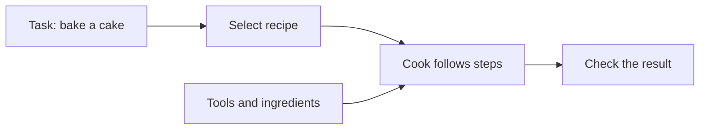
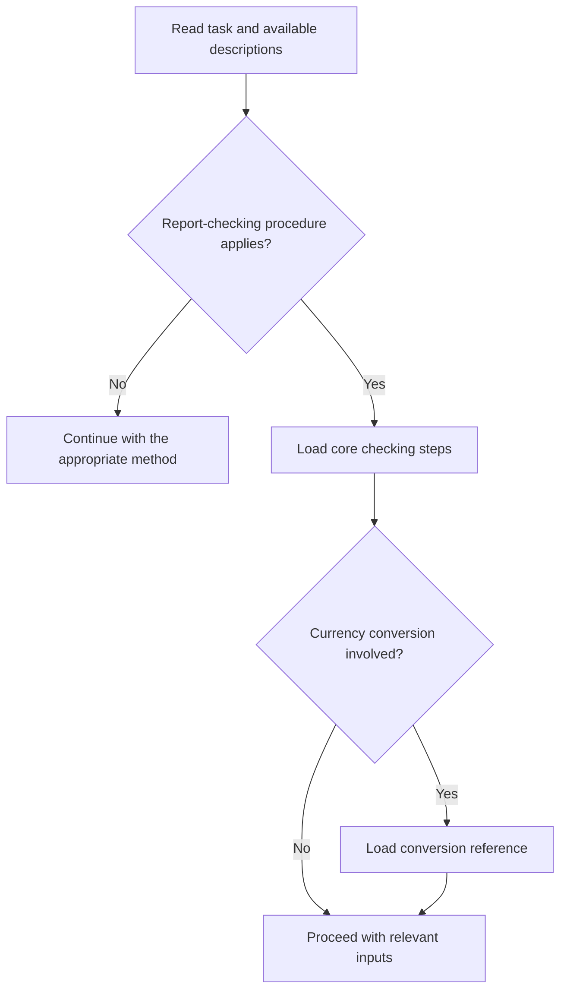
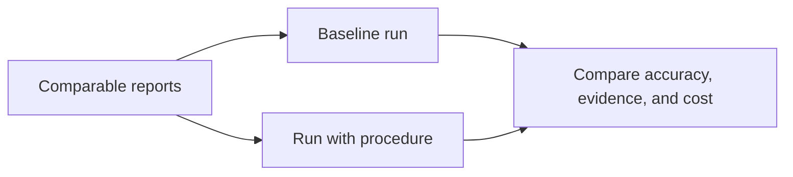
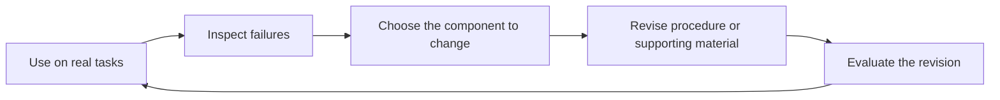

# Chapter 7 · Agent Skills

### Turning recurring work into reusable procedures

> **The central idea:** a skill gives an agent a repeatable method for a specific class of work. The method still needs evidence that it works.

**Learning goals:** distinguish skills from tools and workers, understand selective loading, and evaluate a procedure using realistic tasks.

**Watch:** [Skills Masterclass · Technical Deep Dive on Building Skills for Agentic Systems](https://www.youtube.com/watch?v=nrh1YtPKRD0), by The Carbon Layer.

**Reading basis:** [Agent skills are procedures the harness can load](https://thecarbonlayer.com/agent-skills/).

This chapter is an original study guide, not a transcript. The recap identifies the creator’s framework; the recipe analogy, workshop, diagrams, and evaluation examples are independently constructed teaching material. No executable skill is installed by this chapter.

---

## On this page

- [What the creator teaches](#what-the-creator-teaches)
- [Everyday example: a recipe](#everyday-example-a-recipe)
- [Skill, tool, instruction, and worker](#skill-tool-instruction-and-worker)
- [Workshop: a report-checking procedure](#workshop-a-report-checking-procedure)
- [Load the relevant material](#load-the-relevant-material)
- [Test whether the procedure helps](#test-whether-the-procedure-helps)
- [Maintain the procedure](#maintain-the-procedure)
- [Practice](#practice)

## What the creator teaches

The creator presents skills as reusable procedures loaded for recurring tasks. His example is pull-request review: the agent needs a review method in addition to general guidance and tools.

He distinguishes the procedure from its executor. A main agent or a separate worker can follow the same skill. He also connects skills to procedural memory.

A useful skill identifies when it applies, required inputs, steps, tools, expected outputs, and verification. Supporting references should be loaded selectively rather than attaching an entire manual to every task.

He recommends comparing runs with and without a skill, examining findings, false positives, evidence, cost, and activation behavior. He discusses broad scope, missed activation, stale procedures, excess context, and unsupported confidence. Skills need ownership and revision as workflows change. [Source](https://thecarbonlayer.com/agent-skills/)

## Everyday example: a recipe

Imagine asking someone to bake a cake. They have an oven, ingredients, and a mixing bowl. Those resources make baking possible, but a recipe explains the order and checks.

| Kitchen concept | Agent equivalent |
| :--- | :--- |
| Oven and mixer | Tools that perform actions |
| Recipe | Skill describing how to do a recurring job |
| Cook | Agent executing the procedure |
| “Use the available ingredients” | General instruction |
| Check the baked cake | Verification of the outcome |



A recipe improves repeatability. It does not guarantee success if the oven temperature is wrong or a step is misunderstood. Similarly, a skill supports an agent’s work without proving its result.

## Skill, tool, instruction, and worker

Use these questions to decide what you need:

| Need | Suitable mechanism |
| :--- | :--- |
| Read a file or run a calculation | Tool |
| Apply a standing expectation across tasks | Instruction |
| Follow a recurring method | Skill |
| Give an assignment separate context or execution | Worker or subagent |
| Restrict accessible files | Enforced execution policy |

A skill can recommend a tool. It cannot grant access that the executor denies, and a written restriction does not itself enforce a permission boundary.

## Workshop: a report-checking procedure

Suppose an agent repeatedly checks monthly sales reports. It sometimes summarizes the report without checking its calculations.

The following is an illustrative procedure specification, not an installed skill or a format guaranteed to work in every harness.

### Define the boundary

```text
Use when:
The task asks to check a sales report for numerical consistency.

Do not use when:
The task only asks for a summary or a rewrite.

Required inputs:
Report, source figures, reporting period, and calculation definitions.

If information is missing:
Identify the missing evidence before claiming a verified result.
```

This prevents a simple summary request from becoming an unintended audit.

### Write observable steps

1. Confirm the reporting period and units.
2. Identify totals, percentages, and comparisons.
3. Locate the source figures supporting each checked claim.
4. Recalculate using the declared definitions.
5. Compare calculated values with the report.
6. Report discrepancies and explicitly list unchecked items.

### Define useful output

```text
Finding: The reported growth percentage differs from the recalculation.
Location: Quarterly summary, growth row.
Inputs: Prior period 100; current period 120.
Calculation: (120 - 100) / 100 × 100 = 20%.
Reported value: 25%.
Remaining uncertainty: Confirm both periods use the same revenue definition.
```

A finding should make its reasoning inspectable. Avoid replacing missing evidence with a confident label such as “verified.”

## Load the relevant material

A report checker may have references for revenue, inventory, and currency conversion. Load the relevant ones after identifying the report type.



Selective loading reduces unrelated material. It also needs evaluation: a critical reference that never loads is a failure, even if its contents are excellent.

An illustrative organization could be:

```text
report-checking/
├── procedure.md
├── references/
│   ├── revenue-definitions.md
│   └── currency-conversion.md
├── examples/
│   └── supported-finding.md
└── evaluation/
    └── test-reports.md
```

Packaging varies by harness; consult its supported discovery format when implementing a real skill.

## Test whether the procedure helps

### Compare against a baseline

Run comparable report-checking tasks without the procedure and with it. Keep the model, input evidence, and available tools comparable where possible.



Include a correct report. A checker that always finds something wrong can appear thorough while producing false alarms.

### Visible and unseen examples

Imagine learning to check receipts:

- You practice on receipts your teacher shows you.
- Then you check a new receipt you have not seen.

The practice examples help refine your method. The new example checks whether the method transfers.

For this workshop, visible examples might contain a wrong total and a missing unit. Unseen examples could contain a different arithmetic error or a completely correct report. These are **held-in** and **held-out** examples respectively. Unseen examples need not be edge cases.

Keep evaluation examples separate from material supplied to the agent where required. Repeatedly choosing procedures using the same hidden examples can gradually overfit to them.

### Measure useful outcomes

| Measure | Question |
| :--- | :--- |
| Error detection | Were known discrepancies found? |
| False positives | Were correct values incorrectly flagged? |
| Evidence quality | Can someone reproduce each finding? |
| Coverage | Are unchecked items clearly identified? |
| Activation | Did the procedure apply to the intended tasks? |
| Cost | Did extra steps add worthwhile time and usage? |

Objective calculations can be checked automatically. Whether a finding is understandable and useful may also need human judgment.

## Maintain the procedure



Not every failure belongs in the skill. A broken calculator needs a tool fix. Outdated source data needs a data update. Missing access requires an environment decision.

Assign an owner, retain versions, and remove obsolete steps. Recheck the procedure when definitions, tools, or expectations change.

## Practice

Pick a recurring task such as checking expenses, reviewing code, or preparing a weekly report:

1. State when the procedure should apply and when it should not.
2. List the necessary evidence.
3. Write five observable steps.
4. Provide one example of a supported finding.
5. Test on an incorrect example and a correct one.
6. Reserve a new example to check transfer beyond your drafting cases.

**Connection to earlier chapters:** a skill is reusable procedural knowledge. Context management decides when to load it, tools enable its steps, and verification assesses the resulting work.

---

[← Chapter 6](06-context-management.md) · [Chapter index](../README.md) · [Watch the video ↗](https://www.youtube.com/watch?v=nrh1YtPKRD0)
