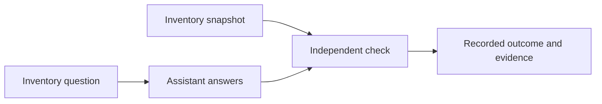
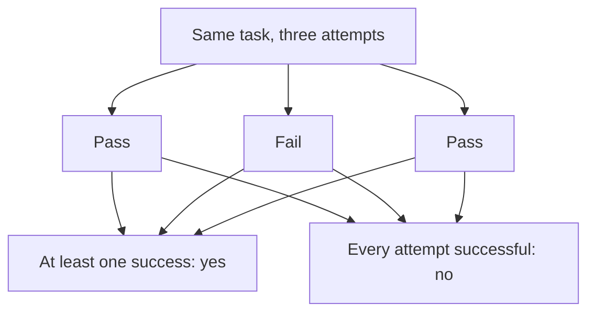
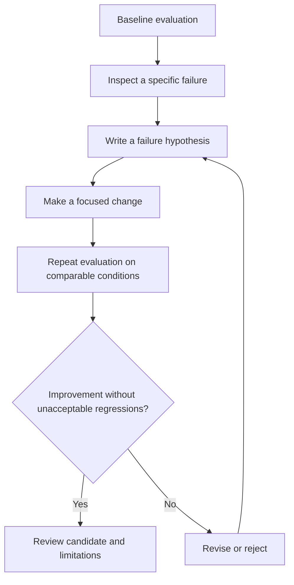
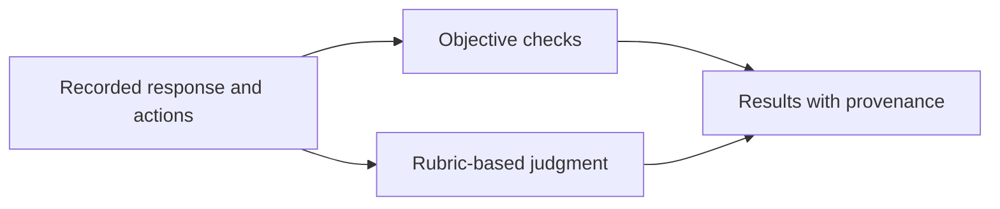

# Chapter 8 · Evaluating AI Agents

### Turning observed behavior into measurable improvements

> **The central idea:** evaluate what an agent actually does, then use the results to decide what to change.

**Learning goals:** understand evaluation vocabulary, distinguish correctness from reliability, and use evidence to diagnose failures and assess fixes.

**Watch:** [Evaluating AI Agents · How Numbers Drive Real Fixes](https://www.youtube.com/watch?v=B9NPE_CaK5Q), by The Carbon Layer.

**Reading basis:** [A domain agent is narrow enough to measure](https://www.thecarbonlayer.com/agent-evaluation/).

This is an original study guide, not a transcript. The recap describes the creator’s experiment. The shop example, diagrams, sample measurements, and exercises are independently constructed teaching material. No evaluation system is implemented by this document.

---

## On this page

- [What the creator demonstrates](#what-the-creator-demonstrates)
- [Everyday example: checking a shop assistant](#everyday-example-checking-a-shop-assistant)
- [Evaluation vocabulary](#evaluation-vocabulary)
- [Six dimensions to inspect](#six-dimensions-to-inspect)
- [Repeated trials and reliability](#repeated-trials-and-reliability)
- [Different kinds of failure](#different-kinds-of-failure)
- [Workshop: diagnose and fix an inventory agent](#workshop-diagnose-and-fix-an-inventory-agent)
- [Grade with appropriate evidence](#grade-with-appropriate-evidence)
- [Practice](#practice)

## What the creator demonstrates

The creator evaluates a read-only cricket-statistics agent on 25 questions, each repeated three times. He measures outcomes, execution paths, cost, reliability, safety, and user experience.

Traces reveal failures such as answering without querying the database and constructing queries against an unknown schema. Providing a schema map improves results but introduces an ambiguity-handling regression. A subsequent instruction addresses that regression.

The article reports the outcome fraction rising from 0.787 to 0.973 and confidently wrong answers falling from eleven to zero in the measured runs. It also reports remaining inconsistent behavior and evaluation gaps. These are results for that experiment, not universal performance guarantees. [Source](https://www.thecarbonlayer.com/agent-evaluation/)

## Everyday example: checking a shop assistant

Imagine hiring an assistant to answer inventory questions. You ask:

> “How many blue notebooks are available?”

The assistant answers “twenty.” To judge the answer, check the inventory record—not how confident the assistant sounded.

One correct answer is encouraging. You also need to know whether the assistant handles different products, unclear requests, unavailable records, and repeated questions.

An evaluation harness is the surrounding system that presents tasks, records behavior, and checks it against declared expectations.

## Evaluation vocabulary

| Term | Plain meaning | Shop example |
| :--- | :--- | :--- |
| **Dataset** | Collection of evaluation tasks | Twenty inventory questions |
| **Item** | One task and its expected behavior | Ask for blue-notebook stock |
| **Metric** | Property being measured | Correct quantity, latency, tool use |
| **Score** | Recorded value for a metric | Correct: yes; elapsed time: 2 seconds |
| **Run** | Execution under recorded conditions | Evaluate version A on a fixed snapshot |
| **Reference answer** | Independently established expectation | Quantity computed from the snapshot |

Define success before running candidates. For an ambiguous question, success might be requesting clarification rather than producing a number.

## Six dimensions to inspect

These examples illustrate the dimensions named in the video description.

| Dimension | Question | Example |
| :--- | :--- | :--- |
| **Outcome** | Was the result correct? | Quantity matches the specified stock definition |
| **Trajectory** | What actions led to it? | Agent queried the relevant item and location |
| **Cost** | What resources were used? | Tool calls, usage, and latency |
| **Reliability** | Does it behave consistently? | Correct across repeated attempts |
| **Safety** | Were task boundaries respected? | No unauthorized stock modifications |
| **Experience** | Was the interaction useful? | It clarifies which branch the user means |

A correct quantity obtained by guessing is weaker evidence than a correct quantity supported by the required source. Conversely, calling the right tool does not guarantee that the final answer uses its result correctly.

## Repeated trials and reliability

Suppose the same question produces these invented results:

| Attempt | Answer | Correct? |
| :--- | ---: | :--- |
| 1 | 20 | Yes |
| 2 | 12 | No |
| 3 | 20 | Yes |

Two of three attempts passed. The task passed **at least once**, but it did not pass **every time**.

In this chapter’s repeated-trial interpretation:

- **pass@k** checks success at least once within `k` attempts.
- **pass^k** checks success on all `k` attempts.

Formal benchmark definitions and estimators can vary; report exactly how you compute your metric.

Three trials expose some variation. They do not prove the probability of future success or guarantee robustness to new inputs.

## Different kinds of failure

Consider two responses when the inventory service is unavailable:

> “There are definitely twenty notebooks.”

> “I could not access the inventory record, so I cannot confirm the quantity.”

The first makes an unsupported factual claim. The second discloses its limitation—an **abstention**.

Track these separately. An abstention may still fail a task that should have been answerable, but it creates a different user risk from a confidently incorrect answer. Also track unnecessary abstentions: an assistant that refuses every question is not useful.

### Clarification can be the correct action

“How many do we have?” omits both product and location. Define whether the expected response is a clarifying question. Do not penalize clarification simply because the agent did not immediately return a quantity.

## Workshop: diagnose and fix an inventory agent

The following scenario and results are invented examples.

### 1. Establish a baseline

Use a fixed inventory snapshot with known quantities. Include normal requests, missing products, ambiguous requests, and unavailable-source conditions.

Record the model configuration, harness version, dataset version, source snapshot, and individual outcomes.

### 2. Inspect the failed execution

Suppose the agent answers “twelve” when the reference quantity is twenty. Its trace contains no inventory lookup.

That suggests a testable hypothesis: the agent answered from an unsupported assumption. It does not prove every wrong answer has the same cause.

### 3. Make a bounded intervention

Try guidance that inventory quantities require source evidence. If source access fails, the response should describe the limitation rather than inventing stock.

### 4. Re-run the broader set

Check that ordinary questions improve without breaking ambiguity handling or increasing unnecessary refusals.

### 5. Read category-level results

Invented results illustrate why a single total is insufficient:

| Category | Baseline passes | Candidate passes |
| :--- | ---: | ---: |
| Clear inventory questions | 6/10 | 9/10 |
| Ambiguous questions | 3/4 | 0/4 |
| **Total** | **9/14** | **9/14** |

The unchanged total conceals a gain and a regression. Retain individual and category results alongside the headline score.

## Grade with appropriate evidence

### Deterministic checks

Use ordinary code for properties that have precise definitions: numeric equality, permitted tool use, output structure, or whether protected data changed.

Choose comparisons deliberately. For currency or measurements, define rounding and units. A number appearing somewhere in the response does not necessarily mean the response answered correctly.

### Human or model-assisted judgment

Clarity and helpfulness may need a rubric. If using a model judge, compare its judgments with human-labeled examples and inspect disagreements. Agreement on a small sample does not establish reliability for every future answer.

### Keep evidence reproducible

Save enough metadata to understand what changed between runs. Changes to the database snapshot or expected-answer function can otherwise look like agent improvements.

Reserve unseen tasks where appropriate. Keep grading material separate from candidate-editable content, and budget evaluation effort according to the importance and variability of the task.

## Practice

Choose a narrow agent job, such as answering questions about a spreadsheet:

1. Write five realistic questions with independently checked expectations.
2. Include an ambiguous question and an unanswerable one.
3. Run each item several times and keep every result.
4. Inspect actions for one failure.
5. Make a targeted change and rerun the set.
6. Report gains, regressions, resource use, and remaining uncertainty.

**Connection to Chapter 2:** an improvement loop proposes changes. Evaluation supplies evidence about those changes, including effects beyond the specific failure they were intended to fix.

---

[← Chapter 7](07-agent-skills.md) · [Chapter index](../README.md) · [Watch the video ↗](https://www.youtube.com/watch?v=B9NPE_CaK5Q)
