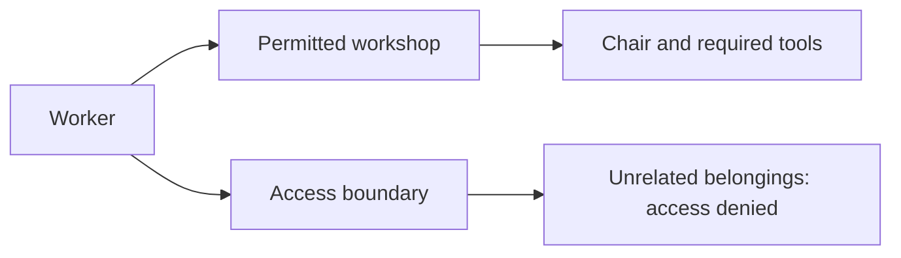
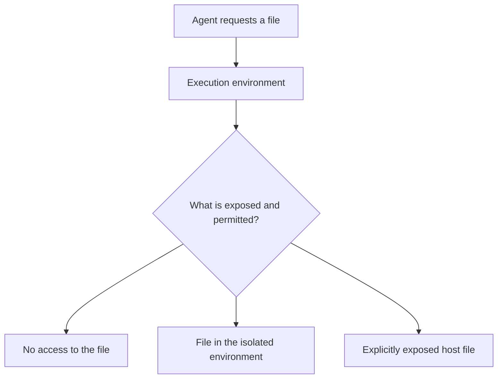
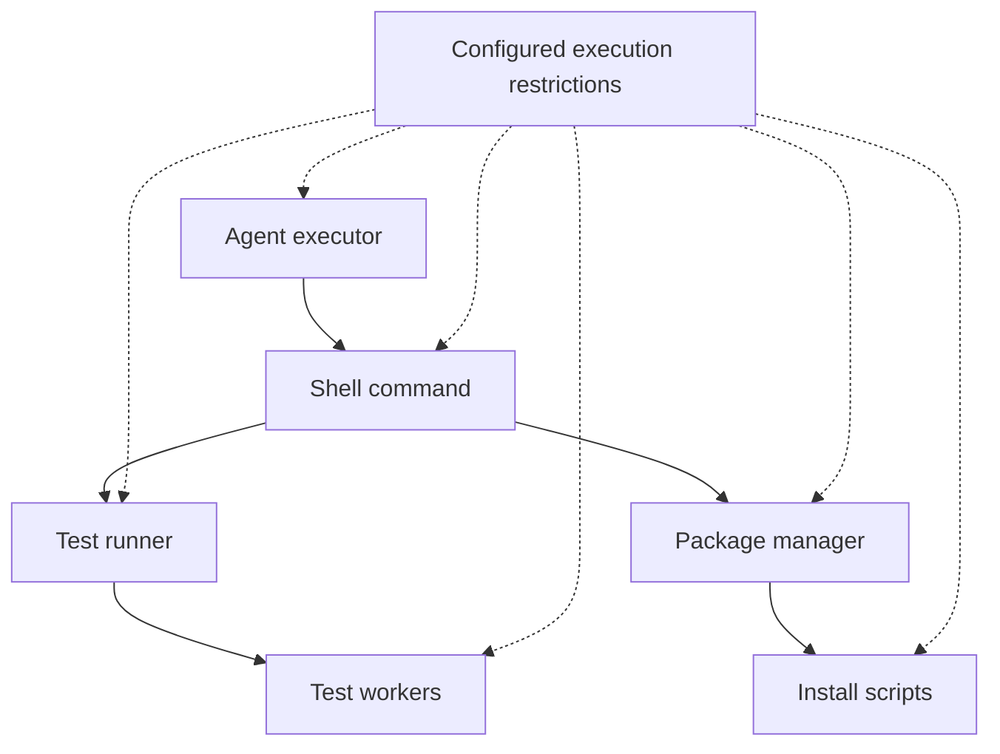
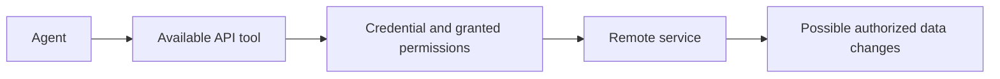
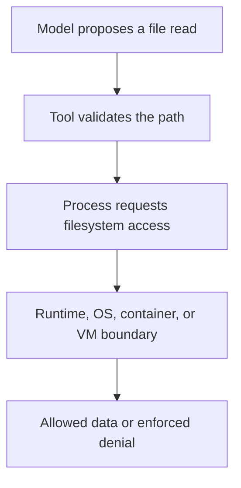

# Chapter 9 · Agent Sandboxing

### Layers, tradeoffs, and blast radius

> **The central idea:** decide what an agent can actually reach, so a mistake has a bounded effect.

**Learning goals:** distinguish guidance from containment, understand the isolation mechanisms, and describe an agent’s permitted files, network, and credentials.

**Watch:** [AI Agent Sandboxing · Layers, Tradeoffs, and Blast Radius](https://www.youtube.com/watch?v=-01_NB4SbBY), by The Carbon Layer.

**Reading basis:** [Agent sandboxing is a blast radius decision](https://www.thecarbonlayer.com/agent-sandboxing/).

This is an original study guide, not a transcript. The recap describes the creator’s framework; the analogies, workshop, diagrams, and exercises are independently constructed examples. No sandbox configuration is installed by this document.

---

## On this page

- [What the creator teaches](#what-the-creator-teaches)
- [Everyday example: a workshop room](#everyday-example-a-workshop-room)
- [Five isolation mechanisms](#five-isolation-mechanisms)
- [Workshop: contain a coding task](#workshop-contain-a-coding-task)
- [Why credentials matter](#why-credentials-matter)
- [Test the boundary](#test-the-boundary)
- [Definitions for your notes](#definitions-for-your-notes)
- [Practice](#practice)
- [Follow the attempted action to the boundary](#follow-the-attempted-action-to-the-boundary)

## What the creator teaches

The creator separates intent—what the agent is asked to do—from containment—what happens when it attempts something else. He compares language-runtime isolation, operating-system sandboxes, containers, user-space kernels, and microVMs.

His file-read example shows that different mechanisms can remove the operation, deny it, or provide a file from an isolated environment. He discusses policy quality, shared kernels, resource limits, network access, child processes, and operational tradeoffs.

He emphasizes that sandboxing does not make every permitted action safe. Valid credentials can authorize damaging remote actions even when local filesystem access is restricted. Tools, credential scope, and execution boundaries therefore need separate consideration. [Source](https://www.thecarbonlayer.com/agent-sandboxing/)

## Everyday example: a workshop room

Imagine hiring someone to repair a chair.

You can say, “Work only on this chair.” That is an instruction. You can also put the chair and necessary tools in a dedicated room and keep unrelated belongings elsewhere. That is a containment boundary.

If the worker makes a mistake, ask what else they can damage. That possible extent of damage is the **blast radius**.

The room still contains things the worker can damage. A boundary limits consequences; it does not guarantee good decisions.

## Five isolation mechanisms

These are conceptual comparisons, not a universal ranking that makes every deployment of one mechanism stronger than every deployment of another.

| Mechanism | Basic boundary | Useful mental model |
| :--- | :--- | :--- |
| **Language-runtime isolation** | Code uses capabilities explicitly exposed by its host | A workspace with only the supplied operations |
| **OS sandbox** | The system restricts a process’s operations | A worker whose access is checked against policy |
| **Container** | A process has an isolated system view while sharing the host kernel | A separate workspace on shared infrastructure |
| **User-space kernel** | An intermediate implementation handles much of the application’s system-call interface | A mediator between workload and host |
| **MicroVM** | A workload runs with a guest kernel under virtualization | A small guest machine |

A **kernel** is the operating-system component managing resources and privileged operations. A **system call** is a request from a program for an operating-system service, such as opening a file.

### The same path can mean a different file

Inside a container, an allowed path can refer to the container’s filesystem rather than the host’s. But a host directory mounted into that environment becomes accessible according to its permissions.

The useful question is which resources are reachable, not merely whether a product uses the word “sandbox.”

## Workshop: contain a coding task

Suppose an agent needs to fix a parser in a local project. This invented example defines a task-specific access plan.

| Resource | Example decision | Reason |
| :--- | :--- | :--- |
| Project checkout | Read and write | Inspect and edit the parser |
| Temporary build directory | Read and write | Run checks and store temporary output |
| Unrelated personal directories | Not exposed | Unnecessary for the task |
| External network | Allow only if justified | Dependencies or documentation may require it |
| Production credentials | Absent | Local parser work does not require production access |
| Compute and elapsed time | Bounded | Avoid uncontrolled resource use |

These decisions must be enforced by the relevant runtime, operating system, or infrastructure. Writing the table alone creates no boundary.

### Remember child processes

A test runner may start workers. A package manager may run installation scripts. Check how limits apply to the whole execution tree.

The diagram expresses the desired coverage. Actual inheritance and enforcement depend on the implementation and need verification.

## Why credentials matter

Return to the workshop analogy. Locking someone in the room does not protect your bank account if you also hand them a phone and valid banking credentials.

Likewise, an agent allowed to contact a production API with a powerful credential can perform remote operations without opening protected local files.

Check three separate questions:

- Which operations do the tools expose?
- Which resources do credentials authorize?
- Which local and network operations does the execution environment permit?

An approval step can support a consequential decision, but it is different from an enforced execution boundary.

## Test the boundary

Use harmless fixtures in a disposable test environment to check allowed and denied behavior.

| Test | What to inspect |
| :--- | :--- |
| Read an allowed fixture | Required access succeeds |
| Read a fixture outside the permitted area | Access is denied as intended |
| Write inside and outside allowed paths | Write restrictions behave as configured |
| Start a child process | Relevant limits continue to apply |
| Attempt a disallowed network destination | Network policy is enforced |
| Exceed a configured resource budget | The system stops or limits work predictably |

An absence of a secret-reading tool is insufficient if a broad shell tool can read the same secret. Examine alternate paths to the resource.

Keep the supported task usable as well. An environment that prevents necessary checks needs a deliberate adjustment, followed by boundary verification.

## Definitions for your notes

| Term | Simple definition |
| :--- | :--- |
| **Sandbox** | A restricted environment for executing work |
| **Containment** | Enforced limits on what execution can affect |
| **Blast radius** | The possible extent of damage from a failure |
| **Policy** | Rules defining permitted and denied operations |
| **Least privilege** | Give only the access the task needs |
| **Credential scope** | The resources and operations a credential authorizes |

## Follow the attempted action to the boundary

An original example: an agent tries to read a payroll file outside its task workspace.

The layers answer different questions. A narrow runtime may have no file-reading capability. An OS policy may deny a real file. A container may expose a different filesystem at the same path. Stronger virtualization changes the boundary further.

### A policy can faithfully enforce the wrong scope

If a sandbox permits the entire home directory, it may correctly allow access to a file the task never needed. Check actual mounts, permitted paths, network destinations, credentials, and child-process behavior.

### Local containment and remote authority

Suppose a confined process still has a valid accounting API token. It may be unable to read host files yet remain able to alter remote invoices. Restrict the token’s permissions and the exposed tool operations separately from local filesystem access.

### Denied, unavailable, and redirected are different

A rejected operation demonstrates a checked boundary. An absent capability gives no operation to request. A redirected file path can succeed against different data. Read the trace carefully before interpreting success or failure.

**For your notes:** choose a boundary for the workload and inspect its configuration. The word “sandbox” alone does not describe what an agent can reach.

## Practice

For an agent task you use:

1. List what the agent must read and write.
2. List credentials and network access it actually needs.
3. Identify resources that should remain unreachable.
4. Ask what happens when a tool starts another process.
5. Write one harmless test for an allowed action and one for a denied action.
6. Describe the remaining blast radius even when the boundary works.

**Connection to Chapter 1:** the execution environment is part of the harness. Instructions guide decisions; containment controls the effects of execution, including when guidance is misunderstood.

---

[← Chapter 8](08-evaluating-ai-agents.md) · [Chapter index](../README.md) · [Watch the video ↗](https://www.youtube.com/watch?v=-01_NB4SbBY)
