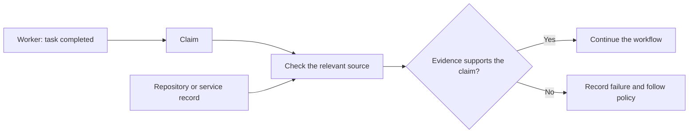
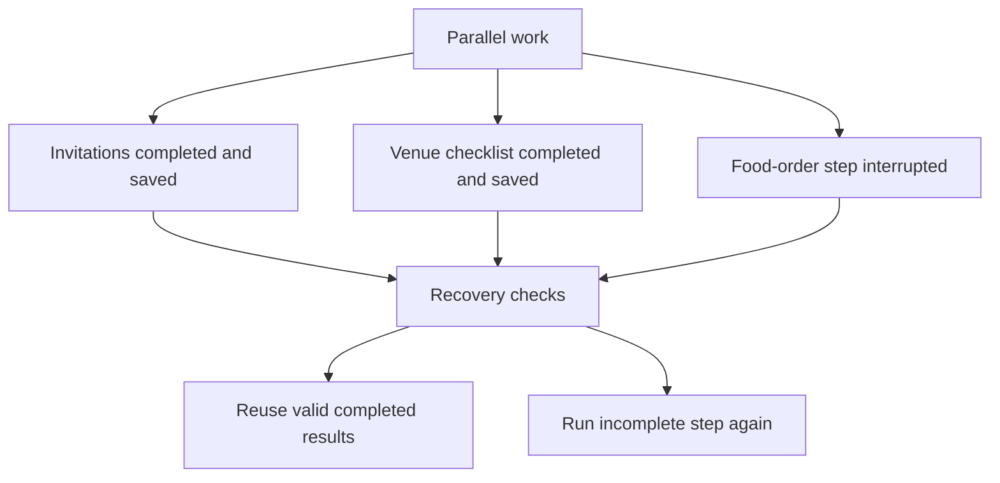
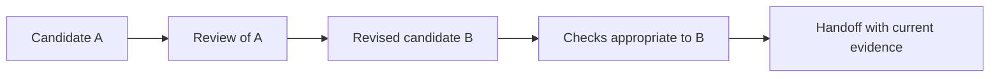
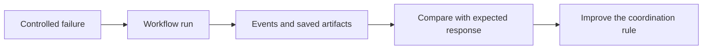

# Chapter 10 · Testing Multi-Agent Systems

### Checking claims, recovering work, and exposing gaps

> **The central idea:** a workflow should act on evidence it can verify, not only on what its workers say they did.

**Learning goals:** distinguish claims from evidence, understand step-level recovery, and recognize why a final revision needs its own checks.

**Watch:** [Meta-Harness · Testing Multi-Agent AI Systems Across 20 Runs](https://www.youtube.com/watch?v=RSOQ0lQ2-1M), by The Carbon Layer.

**Reading basis:** [A meta-harness has to derive the evidence it acts on](https://www.thecarbonlayer.com/meta-harness-build/).

This is an original study guide, not a transcript. The recap describes the creator’s reported prototype runs. The everyday analogies, workshop, diagrams, and exercises are independently constructed teaching material.

---

## On this page

- [What the creator reports](#what-the-creator-reports)
- [Everyday example: a delivery claim](#everyday-example-a-delivery-claim)
- [Validate a claim or derive the evidence](#validate-a-claim-or-derive-the-evidence)
- [Make handoffs inspectable](#make-handoffs-inspectable)
- [Recovery: restart versus resume](#recovery-restart-versus-resume)
- [The final-revision problem](#the-final-revision-problem)
- [Workshop: test the coordination layer](#workshop-test-the-coordination-layer)
- [Definitions for your notes](#definitions-for-your-notes)
- [Practice](#practice)

## What the creator reports

Across twenty prototype runs, the creator observes coordination failures including a fabricated commit identifier, unusable output, unsuitable authority, a failed parallel branch, and unreviewed final changes.

The runtime checks repository evidence and later derives candidate information directly from Git. It records worker configuration, validates output contracts, applies budgets, and preserves completed steps for validated reuse. Recovery remains step-level: it does not resume an interrupted worker mid-flight and depends on retained workspaces.

A final revision introduces syntax errors that the passing tests do not exercise. The workflow exposes missing independent review and stops for human handoff, but does not detect those errors. The experiment demonstrates useful controls and remaining gaps; it does not establish universal correctness across agents or workflows. [Source](https://www.thecarbonlayer.com/meta-harness-build/)

## Everyday example: a delivery claim

Imagine a courier says:

> “I delivered your parcel. Here is the delivery number.”

That statement is a **claim**. You check the delivery record to see whether the parcel was actually delivered. The record is evidence you can inspect.

If a second person simply repeats the courier’s statement, you have two statements—not two independent checks.



For coding agents, “I made commit X” should be checked against the repository before reviews or handoff rely on that identifier.

## Validate a claim or derive the evidence

These are two different approaches.

| Approach | Everyday example | Coding example |
| :--- | :--- | :--- |
| **Validate** | Check a delivery number supplied by the courier | Check whether a worker-supplied commit exists |
| **Derive** | Retrieve the delivery record using the known order | Inspect the task workspace to identify actual changes |

Deriving evidence reduces dependence on the worker copying or inventing identifiers correctly. It still requires correct inspection logic and a reliable relationship between the task and its workspace.

For a candidate change, useful facts may include its base version, actual candidate version, changed files, and associated verification results. A real commit does not itself prove that its code is correct.

## Make handoffs inspectable

A downstream worker needs a clear input, not ambiguous prose that happens to sound complete.

An illustrative review input could be:

```json
{
  "task_id": "parser-empty-input",
  "candidate_id": "version-A",
  "expected_behavior": "Handle empty input without an unhandled error",
  "changed_files": ["parser.py"],
  "verification_artifact": "checks-version-A.json"
}
```

This is a teaching example, not the prototype’s exact contract. Validate required fields and their meanings before relying on the record.

A correctly shaped result can still be substantively empty. For example, a history investigator with no access to repository history might return a valid empty list. Check whether the role had the capabilities needed for its assignment.

## Recovery: restart versus resume

Imagine three people preparing an event:

- One finishes the invitations.
- One finishes the venue checklist.
- One has not finished the food order.

After an interruption, **restart** means asking everyone to do the work again. **Resume** means verifying the finished work and continuing only what remains.



### Reuse needs conditions

Before reusing a stored review, check whether it still applies to the same candidate, task, role configuration, and expected output contract.

If the code changed, yesterday’s review may no longer apply. If a stored result cannot be validated, report that and follow the configured recovery policy.

### Step recovery is not mid-worker recovery

Restarting one interrupted reviewer from its original input is different from continuing that reviewer’s exact internal session. State which behavior your system supports.

Also check side effects. If an interrupted step already created an external record, blindly retrying may create a duplicate.

## The final-revision problem

Imagine a teacher checks your essay and asks for corrections. You change the essay, accidentally delete a paragraph, and submit it without another check.

The teacher reviewed the earlier essay, not the final one.

The same issue occurs when an implementer revises code after reviewers finish.



A revision cap limits how many changes may be attempted. It does not guarantee that the last change was checked. Treat bounded work and reviewed work as separate requirements.

### Passing tests have a scope

If tests cover the parser but never import a modified server file, they might pass while that server contains a syntax error.

Ask what the checks exercised. Use task-appropriate checks for changed behavior and disclose remaining gaps rather than equating any successful command with complete verification.

## Workshop: test the coordination layer

Use controlled failures in a disposable test workflow. These are suggested tests, not measurements from the video.

| Injected condition | Expected behavior to inspect |
| :--- | :--- |
| Worker names a nonexistent candidate | The workflow stops before treating it as valid |
| Worker returns missing required fields | Contract validation records the failure |
| One reviewer never finishes | A configured deadline and failure path apply |
| Another reviewer completed correctly | Its validated result remains available |
| Stored result refers to an older candidate | It is not silently reused for new code |
| Final revision changes an unchecked file | Coverage gap is exposed or relevant checks run |
| Worker exceeds its role’s authority | Enforced policy blocks the action |



Observe decisions between workers, not only their transcripts. Whether a step was scheduled, cancelled, reused, or rejected is a runtime event.

## Definitions for your notes

| Term | Simple definition |
| :--- | :--- |
| **Claim** | What a worker says happened |
| **Evidence** | Inspectable information supporting or contradicting a claim |
| **Output contract** | Required structure and conditions for a step’s result |
| **Attempt budget** | Limit on permitted attempts |
| **Provenance** | Where a result came from and which inputs it concerns |
| **Restart** | Begin work again |
| **Resume** | Continue using applicable saved progress |
| **Revision cap** | Limit on rounds of changes |
| **Fault injection** | Deliberately introduce a controlled failure to test response |

## Practice

Design a two-reviewer workflow and answer:

1. How will you identify the candidate both reviewers inspected?
2. What happens when only one review completes?
3. Which stored results are safe to reuse?
4. What must change if the implementer produces a new version?
5. Which checks cover that final version?
6. What limitations should appear in the handoff?

**Connection to Chapter 5:** the architecture assigns coordination responsibilities. This chapter examines how to test those responsibilities against actual failures and preserve evidence about their limits.

---

[← Chapter 9](09-agent-sandboxing.md) · [Chapter index](../README.md) · [Watch the video ↗](https://www.youtube.com/watch?v=RSOQ0lQ2-1M)
