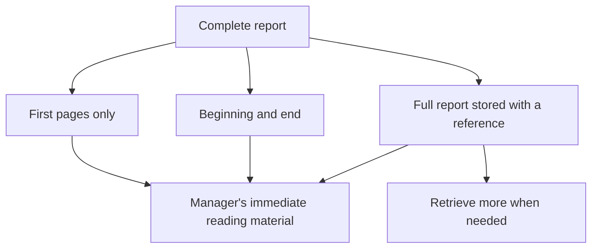
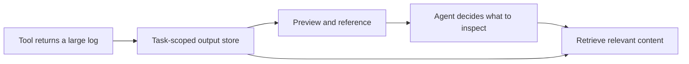
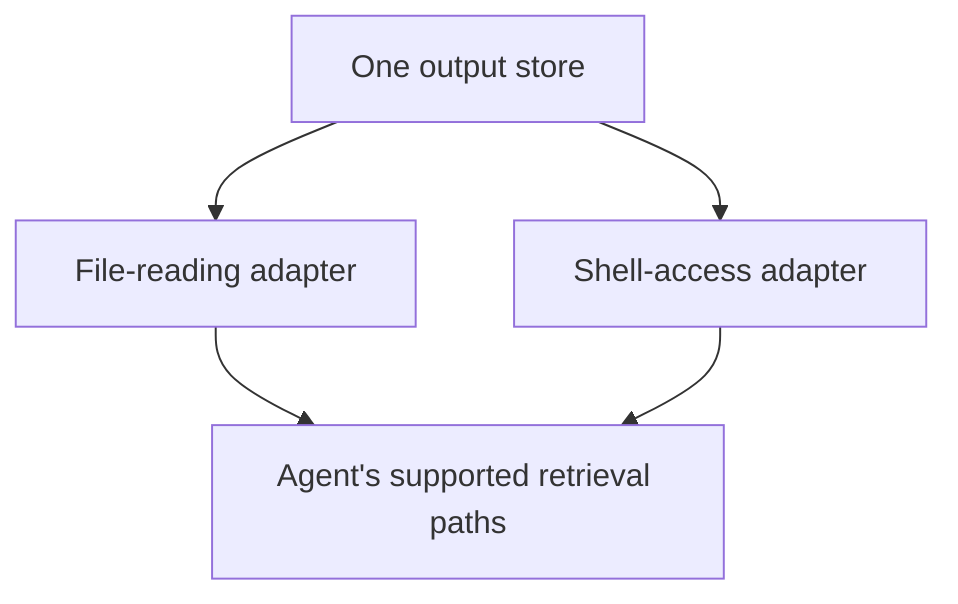
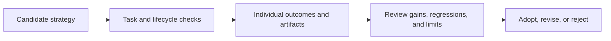

# Chapter 11 · Engineering a Self-Improving Agent

### From increasing a limit to designing an output strategy

> **The central idea:** a passing evaluation supports a change, but adoption also depends on its design, boundaries, and operational behavior.

**Learning goals:** compare output-handling strategies, understand temporary-file ownership, and distinguish stored information from information an agent can actually retrieve.

**Watch:** [The Engineering Behind a Self-Improving AI Agent](https://www.youtube.com/watch?v=qDJIEodb2tk), by The Carbon Layer.

**Source basis:** the video’s [published description and chapter information](https://zolotube.com/watch?v=qDJIEodb2tk). The full transcript was not available when preparing these notes. Implementation repositories: [Carbon](https://github.com/thecarbonlayer/carbon) and [Refinery](https://github.com/thecarbonlayer/refinery).

This is an original study guide, not a transcript or a verified line-by-line account of the source code. The recap reports the description’s claims; the analogies, workshop, diagrams, and exercises are independently constructed teaching material.

---

## On this page

- [What the episode reports](#what-the-episode-reports)
- [Everyday example: a long report](#everyday-example-a-long-report)
- [Three output strategies](#three-output-strategies)
- [Workshop: store a large log temporarily](#workshop-store-a-large-log-temporarily)
- [Stored does not mean reachable](#stored-does-not-mean-reachable)
- [Evaluate the whole behavior](#evaluate-the-whole-behavior)
- [Review before adoption](#review-before-adoption)
- [Definitions for your notes](#definitions-for-your-notes)
- [Practice](#practice)

## What the episode reports

The creator says he rejected the first improvement pull request, which raised the tool-output limit from 4,000 to 12,000 characters, despite passing tests. This follow-up changes the editable surface from a number to named output strategies: clamp, head-and-tail, and offload.

The description reports a test catching secrets left in the workspace, per-run scratch storage with harness-owned cleanup, and retrieval through two adapters: a logical file reference and a bash environment variable. It also reports repeated bash attempts without file-tool calls and measured recovery from 0/5 to 5/5, followed by paired confirmation from 0/10 to 10/10.

These are reported results for particular evaluations, not proof that every task is solved. The episode emphasizes boundaries, evidence, isolation, and promotion as properties the improvement loop does not supply automatically. [Published description](https://zolotube.com/watch?v=qDJIEodb2tk)

## Everyday example: a long report

Imagine a manager must answer a question using a hundred-page report.

You have three possible approaches:

- Give the manager only the first few pages.
- Give the beginning and the conclusion.
- Keep the complete report in an accessible cabinet and provide its reference plus a short preview.

Each approach trades immediate reading effort against the risk of missing information.

Giving someone more pages can fix today’s question. It does not establish a general method for arbitrarily large reports.

## Three output strategies

These examples explain the strategies conceptually; exact limits and interfaces depend on the implementation.

| Strategy | What enters immediate context | Main limitation |
| :--- | :--- | :--- |
| **Clamp** | A bounded portion, often the beginning | Relevant content outside that portion is unavailable in the excerpt |
| **Head-and-tail** | Bounded beginning and ending portions | Important middle content can be omitted |
| **Offload** | A preview plus a reference to stored full content | The agent must have a working way to retrieve the stored content |

For offloading, preserve a clear indication that the preview is incomplete. Otherwise, the agent might mistake it for the whole result.

## Workshop: store a large log temporarily

Suppose an agent receives a long log with a diagnostic message in the middle. This workshop is invented teaching material.

A possible design is:

1. Save the full output in task-scoped temporary storage.
2. Return a bounded preview and a reference.
3. Provide a supported retrieval method.
4. Record the storage and retrieval events.
5. Clean up according to an explicit lifecycle policy.

### Define ownership

Answer these questions before relying on the stored file:

| Question | Example policy |
| :--- | :--- |
| Who creates storage? | The harness at the start of the run |
| Who may read it? | The run's permitted tools |
| How long is it valid? | Until the declared task-storage expiry |
| Who removes it? | The harness lifecycle code |
| What happens on failure? | Cleanup policy still applies |
| What survives for review? | Deliberately retained, appropriately scoped artifacts |

Do not make cleanup depend only on the model remembering to request deletion.

### Temporary storage can retain sensitive content

A log can contain more than the desired diagnostic message. If full output is saved, consider everything in that output—not just the preview shown to the model.

Use explicit access and retention rules. Where crash recovery is relevant, test whether expired storage is discovered and cleaned later. A normal completion hook alone may not handle abrupt termination.

## Stored does not mean reachable

Return to the report analogy. “The report is in the cabinet” is useless if the manager cannot open the cabinet or cannot identify the report.

Likewise, a tool may return a logical reference that another tool cannot interpret.

Adapters should expose access deliberately, without turning a single-run reference into broad filesystem authority.

Observe which tools the agent actually uses. A supported retrieval interface that is never chosen may leave the original task failing. Diagnose the mismatch using recorded actions rather than assuming that clear documentation guarantees correct tool use.

## Evaluate the whole behavior

For this workshop, include several kinds of checks:

| Check | What it tests |
| :--- | :--- |
| Answer in the beginning, middle, and end | Retrieval covers different evidence locations |
| Small output | Ordinary tasks still work |
| Missing or expired reference | Agent reports the limitation clearly |
| Different available retrieval tools | References work through supported paths |
| Successful and failed runs | Lifecycle policy applies consistently |
| Separate concurrent tasks | One task does not receive another task's output |
| Repeated trials | Variation is visible |

Record the model, harness version, strategy configuration, dataset version, and relevant conditions. Passing a narrow set of retrieval tasks does not establish cleanup, isolation, or performance under every condition.

## Review before adoption

Think of installing a larger bucket beneath a leaking pipe. It may pass a test that checks whether the floor stays dry for five minutes. You can still reject it because the underlying design remains inadequate.

For an agent change, ask whether the measured gain is meaningful, what the change cannot solve, and which operational responsibilities it introduces.

Make the change inspectable, keep rejection possible, and define recovery from an accepted change. Passing tests is evidence for a decision, not an obligation to accept the proposal.

## Definitions for your notes

| Term | Simple definition |
| :--- | :--- |
| **Clamp** | Limit the amount of output supplied immediately |
| **Head-and-tail** | Keep the beginning and end of a large result |
| **Offload** | Store full content separately and return a retrieval reference |
| **Scratch space** | Temporary storage used for a task or run |
| **Reachability** | Whether an available tool can access the needed content |
| **Adapter** | A bridge between an interface and an underlying system |
| **Lifecycle** | Creation, use, expiry, and cleanup of a resource |
| **Promotion** | Moving an evaluated candidate into accepted use |

## Practice

Take a large file and answer:

1. What information would each output strategy omit?
2. How would the agent retrieve an offloaded middle section?
3. Who owns the saved file and its cleanup?
4. What happens if the task crashes?
5. Which checks assess the original weakness, and which protect existing behavior?
6. Why might you reject the change even if those checks pass?

**Connection to Chapter 2:** the original loop proposed increasing a limit. This episode revisits adoption and strategy design, showing why a measured local improvement can still need further engineering.

---

[← Chapter 10](10-testing-multi-agent-systems.md) · [Chapter index](../README.md) · [Watch the video ↗](https://www.youtube.com/watch?v=qDJIEodb2tk)
