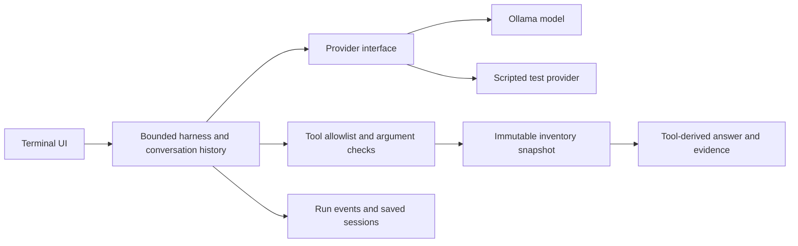

# Inventory agent · implementation guide

This project applies the chapter concepts to a small read-only inventory assistant. It contains a real local-model HTTP adapter and an offline fixture router. The router is a **test double**, not an AI model.

## Architecture



| Module | Responsibility |
| :--- | :--- |
| `providers.py` | Send requests to Ollama or provide reproducible fixture responses |
| `tools.py` | Validate and execute three read-only operations |
| `harness.py` | Bound model attempts, apply policy, preserve history, and render verified results |
| `cli.py` | Accept questions, show results, and optionally persist sessions and traces |
| `evals/run.py` | Compare baseline and improved policies with per-item outcomes |

The model selects a tool and parameters. Quantities and final factual prose are rendered from the tool result. This intentionally narrows the interface: it demonstrates grounded querying rather than unconstrained model-written explanations.

## Offline demo

Run from the repository root with Python 3.11 or later. No API key, dependency installation, or model download is required for this mode.

```sh
python -m inventory_agent.cli "How many blue notebooks at north?"
python -m inventory_agent.cli "How many blue notebooks?"
python -m inventory_agent.cli "Show reorder report for north"
python -m inventory_agent.cli "Delete all stock"
```

Expected output:

```text
Agent > blue notebook at north: 7 in stock.
Agent > Which branch: central or north? Or all branches?
Agent > Reorder report: blue notebook at north: 7 (threshold 10); red folder at north: 3 (threshold 4)
Agent > No verified inventory result. Ask about stock, products, or reorder levels; mutations and unrelated requests are unsupported.
```

The fixture router supports the phrases used in the demo and evaluation; it is not a general natural-language parser.

## Conversation and persistence

```sh
python -m inventory_agent.cli --session artifacts/session.json --trace artifacts/trace.jsonl
```

Example conversation:

```text
You > How many blue notebooks at central?
Agent > blue notebook at central: 20 in stock.
You > And north?
Agent > blue notebook at north: 7 in stock.
You > quit
```

Restart with the same session path to load saved messages. Only user and assistant messages are accepted from session files; system and tool roles are rejected. Sessions are written by atomic file replacement and retain a bounded recent history. This is persistence, not long-term semantic retrieval or crash-resumable tool execution.

## Real local model

Install and start Ollama according to its [official documentation](https://docs.ollama.com/). Select a model that supports tool calling. For example:

```sh
ollama pull qwen3:4b
python -m inventory_agent.cli --provider ollama --model qwen3:4b \
  --session artifacts/local-model-session.json --trace artifacts/local-model-trace.jsonl
```

The model download, hardware requirements, and runtime are external to this repository. The adapter uses Ollama's [chat endpoint](https://docs.ollama.com/api/chat) and [tool-call format](https://docs.ollama.com/capabilities/tool-calling), with non-streamed responses and a request timeout. Use `--endpoint` to change the server address.

**Validation status:** the adapter has a real HTTP integration test against a local mock server. No live model was available in the development environment; no live-model accuracy or latency is claimed. To measure it yourself:

```sh
python -m evals.run --provider ollama --model qwen3:4b --repeats 3 \
  --output artifacts/live-evaluation.json
```

Inspect individual failures as well as totals. The included evaluation is a small public development suite, not a sealed held-out benchmark. Both policies share the same provider and prompt; the comparison changes the branch-handling policy.

## Read-only boundaries

The exposed tool registry contains only `get_stock`, `list_products`, and `reorder_report`. It offers no stock mutation, arbitrary file read, shell command, or SQL execution. Unknown tools are denied and unexpected arguments are rejected.

Stock records are loaded read-only from a CSV into frozen records. The CLI does write session and trace files when the user requests those paths. Thus “read-only” means the inventory capabilities, not a globally read-only Python process.

This is **not an OS sandbox**. The tool boundary does not defend against compromised application code or a hostile model server. A production service would additionally need authentication, scoped storage, endpoint policy, concurrency controls, and enforced environment isolation.

The improved policy checks branch selection outside the model. If the current request omits a recognized branch, the executor asks for clarification even when a model guessed one. Recognized explicit branches are `central`, `north`, and the phrase `all branches`. Product matching in real-model mode depends on model-selected exact product names; abbreviations and unrestricted conversation references are outside the current contract.

## Budgets and failure handling

- Questions are bounded to 4,000 characters.
- History defaults to 40 messages.
- Invalid tool arguments can be corrected within four model attempts.
- One tool call per response is supported; malformed or multi-call responses fail explicitly.
- A successful, unknown, denied, or ambiguous tool result terminates the turn.
- Unsupported model prose cannot become a factual inventory answer.
- Unavailable model endpoints return an unverified error, not a guessed answer.

Each factual answer includes tool name, validated arguments, and result in `--json` mode. Trace events record model attempts, tool execution, and final status. Raw model reasoning and provider credentials are not logged; questions and tool arguments may still contain user data, so session/trace retention is an operator responsibility.

## Extending the project

A useful next step is adding unseen questions and multi-turn clarification cases for a live model. Keep those separate from the fixture router and report live results independently. Further enhancements could include a database-backed inventory, more robust branch resolution, or a governed multi-tool workflow, each with new tests and evaluation cases.
